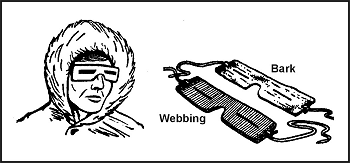

The best way to deal with injuries and sicknesses is to take measures to prevent them from happening in the first place. Treat any injury or sickness that occurs as soon as possible to prevent it from worsening.

The knowledge of signs and symptoms and the use of the buddy system are critical in maintaining health. The following paragraphs explain some cold injuries that can occur.

**HYPOTHERMIA**

Hypothermia is the lowering of the body temperature at a rate faster than the body can produce heat. Causes of hypothermia may be general exposure or the sudden wetting of the body by falling into a lake or spraying with fuel or other liquids.

The initial symptom is shivering. This shivering may progress to the point that it is uncontrollable and interferes with an individual's ability to care for oneself. This begins when the body's core temperature falls to about 35.5 degrees C (96 degrees F). When the core temperature reaches 35 to 32 degrees C (95 to 90 degrees F), sluggish thinking, irrational reasoning, and a false feeling of warmth may occur. Core temperatures of 32 to 30 degrees C (90 to 86 degrees F) and below result in muscle rigidity, unconsciousness, and barely detectable signs of life. If the victim's core temperature falls below 25 degrees C (77 degrees F), death is almost certain.

To treat hypothermia, rewarm the entire body. If there are means available, rewarm the person by first immersing the trunk area only in warm water of 37.7 to 43.3 degrees C (100 to 110 degrees F).

> **CAUTION**
>
> Rewarming the total body in a warm water bath should be done only in a hospital environment because of the increased risk of cardiac arrest and rewarming shock.

One of the quickest ways to get heat to the inner core is to give warm water enemas. However, such an action may not be possible in a survival situation. Another method is to wrap the victim in a warmed sleeping bag with another person who is already warm; both should be naked.

<table cellspacing="0" cellpadding="7" border="1" width="400">

<tbody>

<tr>

<td valign="top">

**CAUTION**

The individual placed in the sleeping bag with the victim could also become a hypothermia victim if left in the bag too long.

</td>

</tr>

</tbody>

</table>

If the person is conscious, give him hot, sweetened fluids. Honey or dextrose are best, but if they are unavailable, sugar, cocoa, or a similar soluble sweetener may be used.

> **CAUTION**
>
> Do not force an unconscious person to drink.

There are two dangers in treating hypothermia: rewarming too rapidly and "after-drop." Rewarming too rapidly can cause the victim to have circulatory problems, resulting in heart failure. After-drop is the sharp body core temperature drop that occurs when taking the victim from the warm water. Its probable cause is the return of previously stagnant limb blood to the core (inner torso) area as recirculation occurs. Concentrating on warming the core area and stimulating peripheral circulation will lessen the effects of after-drop. Immersing the torso in a warm bath, if possible, is the best treatment.

**FROSTBITE**

This injury is the result of frozen tissues. Light frostbite involves only the skin that takes on a dull whitish pallor. Deep frostbite extends to a depth below the skin. The tissues become solid and immovable. Your feet, hands, and exposed facial areas are particularly vulnerable to frostbite.

The best frostbite prevention, when you are with others, is to use the buddy system. Check your buddy's face often and make sure that he checks yours. If you are alone, periodically cover your nose and lower part of your face with your mittened hand.

The following pointers will aid you in keeping warm and preventing frostbite when it is extremely cold or when you have less than adequate clothing:

* _Face._ Maintain circulation by "making faces." Warm with your hands.
* _Ears._ Wiggle and move your ears. Warm with your hands.
* _Hands._ Move your hands inside your gloves. Warm by placing your hands close to your body.
* _Feet._ Move your feet and wiggle your toes inside your boots.

A loss of feeling in your hands and feet is a sign of frostbite. If you have lost feeling for only a short time, the frostbite is probably light. Otherwise, assume the frostbite is deep. To rewarm a light frostbite, use your hands or mittens to warm your face and ears. Place your hands under your armpits. Place your feet next to your buddy's stomach. A deep frostbite injury, if thawed and refrozen, will cause more damage than a nonmedically trained person can handle. [Figure 15-2](#fig15-2), lists some "dos and don'ts" regarding frostbite.

|Do|Don't|
|--|-----|
|Periodically check for frostbite.|Rub injury with snow.|
|Rewarm light frostbite.|Drink alcoholic beverages.|
|Keep injuried areas from refreezing.|Smoke.|
| |Try to thaw out a deep frostbite injury if you are away from definitive medical care.|

**Figure 15-2\. Frostbite Dos and Don'ts**

**TRENCH FOOT AND IMMERSION FOOT**

These conditions result from many hours or days of exposure to wet or damp conditions at a temperature just above freezing. The symptoms are a sensation of pins and needles, tingling, numbness, and then pain. The skin will initially appear wet, soggy, white, and shriveled. As it progresses and damage appears, the skin will take on a red and then a bluish or black discoloration. The feet become cold, swollen, and have a waxy appearance. Walking becomes difficult and the feet feel heavy and numb. The nerves and muscles sustain the main damage, but gangrene can occur. In extreme cases, the flesh dies and it may become necessary to have the foot or leg amputated. The best prevention is to keep your feet dry. Carry extra socks with you in a waterproof packet. You can dry wet socks against your torso (back or chest). Wash your feet and put on dry socks daily.

**DEHYDRATION**

When bundled up in many layers of clothing during cold weather, you may be unaware that you are losing body moisture. Your heavy clothing absorbs the moisture that evaporates in the air. You must drink water to replace this loss of fluid. Your need for water is as great in a cold environment as it is in a warm environment ([see Desert](Desert)). One way to tell if you are becoming dehydrated is to check the color of your urine on snow. If your urine makes the snow dark yellow, you are becoming dehydrated and need to replace body fluids. If it makes the snow light yellow to no color, your body fluids have a more normal balance.

**COLD DIURESIS**

Exposure to cold increases urine output. It also decreases body fluids that you must replace.

**SUNBURN**

Exposed skin can become sunburned even when the air temperature is below freezing. The sun's rays reflect at all angles from snow, ice, and water, hitting sensitive areas of skin - lips, nostrils, and eyelids. Exposure to the sun results in sunburn more quickly at high altitudes than at low altitudes. Apply sunburn cream or lip salve to your face when in the sun.

**SNOW BLINDNESS**

The reflection of the sun's ultraviolet rays off a snow-covered area causes this condition. The symptoms of snow blindness are a sensation of grit in the eyes, pain in and over the eyes that increases with eyeball movement, red and teary eyes, and a headache that intensifies with continued exposure to light. Prolonged exposure to these rays can result in permanent eye damage. To treat snow blindness, bandage your eyes until the symptoms disappear.

You can prevent snow blindness by wearing sunglasses. If you don't have sunglasses, improvise. Cut slits in a piece of cardboard, thin wood, tree bark, or other available material ([Figure 15-3](#fig15-3)). Putting soot under your eyes will help reduce shine and glare.

**Figure 15-3\. Improvised Sunglasses**

**CONSTIPATION**

It is very important to relieve yourself when needed. Do not delay because of the cold condition. Delaying relieving yourself because of the cold, eating dehydrated foods, drinking too little liquid, and irregular eating habits can cause you to become constipated. Although not disabling, constipation can cause some discomfort. Increase your fluid intake to at least 2 liters above your normal 2 to 3 liters daily intake and, if available, eat fruit and other foods that will loosen the stool.

**INSECT BITES**

Insect bites can become infected through constant scratching. Flies can carry various disease-producing germs. To prevent insect bites, use insect repellent and netting and wear proper clothing. See [Chapter Animals](Animals) for information on insect bites and [Medicine](Medicine) for treatment.
