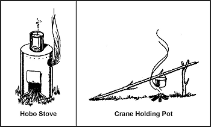

15-55\. Fire is especially important in cold weather. It not only provides a means to prepare food, but also to get warm and to melt snow or ice for water. It also provides you with a significant psychological boost by making you feel a little more secure in your situation.

15-56\. Use the techniques described in [Chapter Fire](Fire) to build and light your fire. If you are in enemy territory, remember that the smoke, smell, and light from your fire may reveal your location. Light reflects from surrounding trees or rocks, making even indirect light a source of danger. Smoke tends to go straight up in cold, calm weather, making it a beacon during the day, but helping to conceal the smell at night. In warmer weather, especially in a wooded area, smoke tends to hug the ground, making it less visible in the day, but making its odor spread.

15-57\. If you are in enemy territory, cut low tree boughs rather than the entire tree for firewood. Fallen trees are easily seen from the air.

15-58\. All wood will burn, but some types of wood create more smoke than others. For instance, coniferous trees that contain resin and tar create more and darker smoke than deciduous trees.

15-59\. There are few materials to use for fuel in the high mountainous regions of the arctic. You may find some grasses and moss, but very little. The lower the elevation, the more fuel available. You may find some scrub willow and small, stunted spruce trees above the tree line. On sea ice, fuels are seemingly nonexistent. Driftwood or fats may be the only fuels available to a survivor on the barren coastlines in the arctic and subarctic regions.

15-60\. Abundant fuels within the tree line are as follows:

* Spruce trees are common in the interior regions. As a conifer, spruce makes a lot of smoke when burned in the spring and summer months. However, it burns almost smoke-free in late fall and winter.
* The tamarack tree is also a conifer. It is the only tree of the pine family that loses its needles in the fall. Without its needles, it looks like a dead spruce, but it has many knobby buds and cones on its bare branches. When burning, tamarack wood makes a lot of smoke and is excellent for signaling purposes.
* Birch trees are deciduous and the wood burns hot and fast, as if soaked with oil or kerosene. Most birches grow near streams and lakes, but occasionally you will find a few on higher ground and away from water.
* Willow and alder grow in arctic regions, normally in marsh areas or near lakes and streams. These woods burn hot and fast without much smoke.

15-61\. Dried moss, grass, and scrub willow are other materials you can use for fuel. These are usually plentiful near streams in tundras (open, treeless plains). By bundling or twisting grasses or other scrub vegetation to form a large, solid mass, you will have a slower burning, more productive fuel.

15-62\. If fuel or oil is available from a wrecked vehicle or downed aircraft, use it for fuel. Leave the fuel in the tank for storage, drawing on the supply only as you need it. Oil congeals in extremely cold temperatures, therefore, drain it from the vehicle or aircraft while still warm if there is no danger of explosion or fire. If you have no container, let the oil drain onto the snow or ice. Scoop up the fuel as you need it.

> **CAUTION**
>
> Do not expose flesh to petroleum, oil, and lubricants in extremely cold temperatures. The liquid state of these products is deceptive in that it can cause frostbite.

15-63\. Some plastic products, such as MRE spoons, helmet visors, visor housings, and foam rubber will ignite quickly from a burning match. They will also burn long enough to help start a fire. For example, a plastic spoon will burn for about 10 minutes.

15-64\. In cold weather regions, there are some hazards in using fires, whether to keep warm or to cook. For example:
*  Fires have been known to burn underground, resurfacing nearby. Therefore, do not build a fire too close to a shelter.
*  In snow shelters, excessive heat will melt the insulating layer of snow that may also be your camouflage.
*  A fire inside a shelter lacking adequate ventilation can result in carbon monoxide poisoning.
*  A person trying to get warm or to dry clothes may become careless and burn or scorch his clothing and equipment.
*  Melting overhead snow may get you wet, bury you and your equipment, and possibly extinguish your fire.

15-65\. In general, a small fire and some type of stove is the best combination for cooking purposes. A hobo stove ([Figure 15-7](#fig15-7)) is particularly suitable to the arctic. It is easy to make out of a tin can, and it conserves fuel. A bed of hot coals provides the best cooking heat. Coals from a crisscross fire will settle uniformly. Make this type of fire by crisscrossing the firewood. A simple crane propped on a forked stick will hold a cooking container over a fire.

**Figure 15-7\. Cooking Fire and Stove**

15-66\. For heating purposes, a single candle provides enough heat to warm an enclosed shelter. A small fire about the size of a man's hand is ideal for use in enemy territory. It requires very little fuel, yet it generates considerable warmth and is hot enough to warm liquids.
