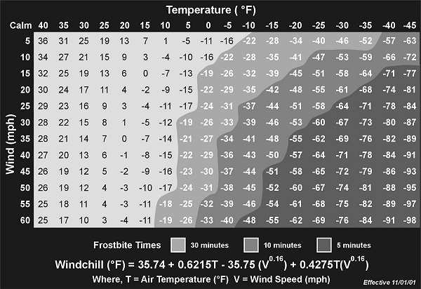

Windchill increases the hazards in cold regions. Windchill is the effect of moving air on exposed flesh. For instance, with a 27.8-kph (15-knot) wind and a temperature of -10 degrees C (14 degrees F), the equivalent windchill temperature is -23 degrees C (-9 degrees F). [Figure 15-1](#fig15-1) gives the windchill factors for various temperatures and wind speeds.

**Figure 15-1\. Windchill Table**

Remember, even when there is no wind, you will create the equivalent wind by skiing, running, being towed on skis behind a vehicle, or working around aircraft that produce windblasts.
