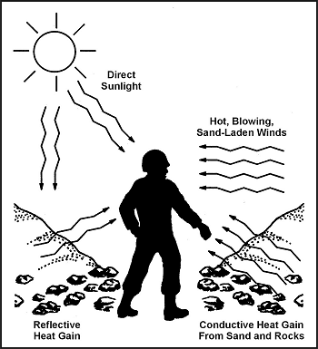

13-9\. Surviving and evading the enemy in an arid area depends on what you know and how prepared you are for the environmental conditions you will face. Determine what equipment you will need, the tactics you will use, and the environment's impact on them and you.

13-10\. In a desert area there are seven environmental factors that you must consider:

*  Low rainfall.
*  Intense sunlight and heat.
*  Wide temperature range.
*  Sparse vegetation.
*  High mineral content near ground surface.
*  Sandstorms.
*  Mirages.

**LOW RAINFALL**

13-11\. Low rainfall is the most obvious environmental factor in an arid area. Some desert areas receive less than 10 centimeters (4 inches) of rain annually, and this rain comes in brief torrents that quickly run off the ground surface. You cannot survive long without water in high desert temperatures. In a desert survival situation, you must first consider the amount of water you have and other water sources.

**INTENSE SUNLIGHT AND HEAT**

13-12\. Intense sunlight and heat are present in all arid areas. Air temperature can rise as high as 60 degrees C (140 degrees F) during the day. Heat gain results from direct sunlight, hot blowing sand-laden winds, reflective heat (the sun's rays bouncing off the sand), and conductive heat from direct contact with the desert sand and rock ([Figure 13-1](#fig13-1)).

**Figure 13-1\. Types of Heat Gain**

13-13\. The temperature of desert sand and rock typically range from 16 to 22 degrees C (30 to 40 degrees F) more than that of the air. For instance, when the air temperature is 43 degrees C (110 degrees F), the sand temperature may be 60 degrees C (140 degrees F).

13-14\. Intense sunlight and heat increase the body's need for water. To conserve your body fluids and energy, you will need a shelter to reduce your exposure to the heat of the day. Travel at night to lessen your use of water.

13-15\. Radios and sensitive items of equipment exposed to direct intense sunlight will malfunction.

**WIDE TEMPERATURE RANGE**

13-16\. Temperatures in arid areas may get as high as 55 degrees C (130 degrees F) during the day and as low as 10 degrees C (50 degrees F) during the night. The drop in temperature at night occurs rapidly and will chill a person who lacks warm clothing and is unable to move about. The cool evenings and nights are the best times to work or travel. If your plan is to rest at night, you will find a wool sweater, long underwear, and a wool stocking cap extremely helpful.

**SPARSE VEGETATION**

13-17\. Vegetation is sparse in arid areas. You will therefore have trouble finding shelter and camouflaging your movements. During daylight hours, large areas of terrain are visible and easily controlled by a small opposing force.

13-18\. If traveling in hostile territory, follow the principles of desert camouflage:

*  Hide or seek shelter in dry washes (wadis) with thicker growths of vegetation and cover from oblique observation.
*  Use the shadows cast from brush, rocks, or outcroppings. The temperature in shaded areas will be 11 to 17 degrees C (52 to 63 degrees F) cooler than the air temperature.
*  Cover objects that will reflect the light from the sun.

13-19\. Before moving, survey the area for sites that provide cover and concealment. You will have trouble estimating distance. The emptiness of desert terrain causes most people to underestimate distance by a factor of three: What appears to be 1 kilometer (1/2 mile) away is really 3 kilometers (1 3/4 miles) away.

**HIGH MINERAL CONTENT**

13-20\. All arid regions have areas where the surface soil has a high mineral content (borax, salt, alkali, and lime). Material in contact with this soil wears out quickly, and water in these areas is extremely hard and undrinkable. Wetting your uniform in such water to cool off may cause a skin rash. The Great Salt Lake area in Utah is an example of this type of mineral-laden water and soil. There is little or no plant life; therefore, shelter is hard to find. Avoid these areas if possible.

**SANDSTORMS**

13-21\. Sandstorms (sand-laden winds) occur frequently in most deserts. The _Seistan_ desert wind in Iran and Afghanistan blows constantly for up to 120 days. Within Saudi Arabia, winds typically range from 3.2 to 4.8 kilometers per hour (kph) (2 to 3 miles per hour [mph]) and can reach 112 to 128 kph (67 to 77 mph) in early afternoon. Expect major sandstorms and dust storms at least once a week.

13-22\. The greatest danger is getting lost in a swirling wall of sand. Wear goggles and cover your mouth and nose with cloth. If natural shelter is unavailable, mark your direction of travel, lie down, and sit out the storm.

13-23\. Dust and wind-blown sand interfere with radio transmissions. Therefore, be ready to use other means for signaling, such as pyrotechnics, signal mirrors, or marker panels, if available.

**MIRAGES**

13-24\. Mirages are optical phenomena caused by the refraction of light through heated air rising from a sandy or stony surface. They occur in the interior of the desert about 10 kilometers (6 miles) from the coast. They make objects that are 1.5 kilometers (1 mile) or more away appear to move.

13-25\. This mirage effect makes it difficult for you to identify an object from a distance. It also blurs distant range contours so much that you feel surrounded by a sheet of water from which elevations stand out as "islands."

13-26\. The mirage effect makes it hard for a person to identify targets, estimate range, and see objects clearly. However, if you can get to high ground (3 meters [10 feet] or more above the desert floor), you can get above the superheated air close to the ground and overcome the mirage effect. Mirages make land navigation difficult because they obscure natural features. You can survey the area at dawn, dusk, or by moonlight when there is little likelihood of mirage.

13-27\. Light levels in desert areas are more intense than in other geographic areas. Moonlit nights are usually crystal clear, winds die down, haze and glare disappear, and visibility is excellent. You can see lights, red flashlights, and blackout lights at great distances. Sound carries very far.

13-28\. Conversely, during nights with little moonlight, visibility is extremely poor. Traveling is extremely hazardous. You must avoid getting lost, falling into ravines, or stumbling into enemy positions. Movement during such a night is practical only if you have a compass and have spent the day resting, observing, and memorizing the terrain, and selecting your route.
