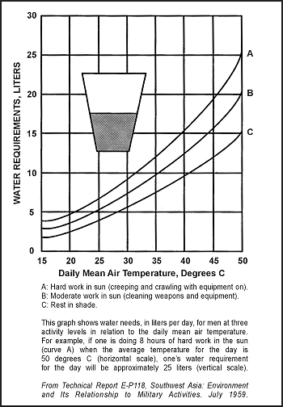

13-29\. The subject of man and water in the desert has generated considerable interest and confusion since the early days of World War II when the U.S. Army was preparing to fight in North Africa. At one time, the U.S. Army thought it could condition men to do with less water by progressively reducing their water supplies during training. They called it water discipline. It caused hundreds of heat casualties.

13-30\. A key factor in desert survival is understanding the relationship between physical activity, air temperature, and water consumption. The body requires a certain amount of water for a certain level of activity at a certain temperature. For example, a person performing hard work in the sun at 43 degrees C (109 degrees F) requires 19 liters (5 gallons) of water daily. Lack of the required amount of water causes a rapid decline in an individual's ability to make decisions and to perform tasks efficiently.

13-31\. Your body's normal temperature is 36.9 degrees C (98.6 degrees F). Your body gets rid of excess heat (cools off) by sweating. The warmer your body becomes - whether caused by work, exercise, or air temperature - the more you sweat. The more you sweat, the more moisture you lose. Sweating is the principal cause of water loss. If you stop sweating during periods of high air temperature and heavy work or exercise, you will quickly develop heat stroke. This is an emergency that requires immediate medical attention.

13-32\. [Figure 13-2](#fig13-2) shows daily water requirements for various levels of work. Understanding how the air temperature and your physical activity affect your water requirements allows you to take measures to get the most from your water supply. These measures are:

*  Find shade! Get out of the sun!
*  Place something between you and the hot ground.
*  Limit your movements!
*  Conserve your sweat. Wear your complete uniform to include T-shirt. Roll the sleeves down, cover your head, and protect your neck with a scarf or similar item. These steps will protect your body from hot-blowing winds and the direct rays of the sun. Your clothing will absorb your sweat, keeping it against your skin so that you gain its full cooling effect. By staying in the shade quietly, fully clothed, not talking, keeping your mouth closed, and breathing through your nose, your water requirement for survival drops dramatically.
*  If water is scarce, do not eat. Food requires water for digestion; therefore, eating food will use water that you need for cooling.

**Figure 13-2\. Daily Water Requirements for Three Levels of Activity**

13-33\. Thirst is not a reliable guide for your need for water. A person who uses thirst as a guide will drink only two-thirds of his daily water requirement. To prevent this "voluntary" dehydration, use the following guide:

*  At temperatures below 38 degrees C (100 degrees F), drink 0.5 liter of water every hour.
*  At temperatures above 38 degrees C (100 degrees F), drink 1 liter of water every hour.

13-34\. Drinking water at regular intervals helps your body remain cool and decreases sweating. Even when your water supply is low, sipping water constantly will keep your body cooler and reduce water loss through sweating. Conserve your fluids by reducing activity during the heat of day. **Do not** ration your water! If you try to ration water, you stand a good chance of becoming a heat casualty.
