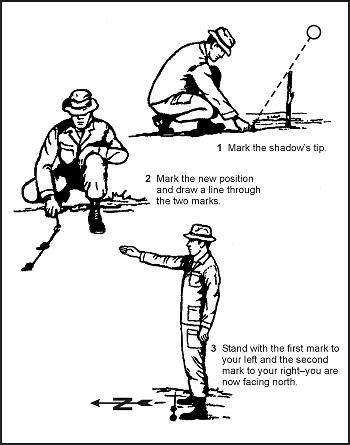
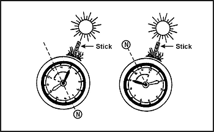

18-1\. The earth's relationship to the sun can help you to determine direction on earth. The sun always rises in the east and sets in the west, but not exactly due east or due west. There is also some seasonal variation. Shadows will move in the opposite direction of the sun. In the Northern Hemisphere, they will move from west to east, and will point north at noon. In the Southern Hemisphere, shadows will indicate south at noon. With practice, you can use shadows to determine both direction and time of day. The shadow methods used for direction finding are the shadow-tip and watch methods.

**SHADOW-TIP METHODS**

18-2\. In the first shadow-tip method, find a straight stick 1 meter (3 feet) long, and a level spot free of brush on which the stick will cast a definite shadow. This method is simple and accurate and consists of four steps:
*  _Step 1._ Place the stick or branch into the ground at a level spot where it will cast a distinctive shadow. Mark the shadow's tip with a stone, twig, or other means. This first shadow mark is always west - **everywhere** on earth.
*  _Step 2._ Wait 10 to 15 minutes until the shadow tip moves a few centimeters. Mark the shadow tip's new position in the same way as the first. This mark will represent East.
*  _Step 3._ Draw a straight line through the two marks to obtain an approximate east-west line.
*  _Step 4._ Stand with the first mark (west) to your left and the second mark to your right - you are now facing north. This fact is true **everywhere** on earth.

18-3\. An alternate method is more accurate but requires more time. Set up your shadow stick and mark the first shadow in the morning. Use a piece of string to draw a clean arc through this mark and around the stick. At midday, the shadow will shrink and disappear. In the afternoon, it will lengthen again and at the point where it touches the arc, make a second mark. Draw a line through the two marks to get an accurate east-west line ([Figure 18-1](#fig18-1)).

**Figure 18-1\. Shadow-Tip Method**

**THE WATCH METHOD**

18-4\. You can also determine direction using a common or analog watch - one that has hands. The direction will be accurate if you are using true local time, without any changes for daylight savings time. Remember, the further you are from the equator, the more accurate this method will be. If you only have a digital watch, draw a clock face on a circle of paper with the correct time on it and use it to determine your direction at that time. You may also choose to draw a clock face on the ground or lay your watch on the ground for a more accurate reading.

18-5\. In the Northern Hemisphere, hold the watch horizontal and point the hour hand at the sun. Bisect the angle between the hour hand and the 12-o'clock mark to get the north-south line ([Figure 18-2](#fig18-2)). If there is any doubt as to which end of the line is north, remember that the sun rises in the east, sets in the west, and is due south at noon. The sun is in the east before noon and in the west after noon.

**Figure 18-2\. Watch Method**

**NOTE:** If your watch is set on daylight savings time, use the midway point between the hour hand and 1 o'clock to determine the north-south line.

18-6\. In the Southern Hemisphere, point the watch's 12-o'clock mark toward the sun; a midpoint halfway between 12 and the hour hand will give you the north-south line ([Figure 18-2](#fig18-2)).

18-7\. Another method is called the 24-hour clock method. Take the local military time and divide it by two. Imagine this result to now represent the hour hand. In the Northern Hemisphere, point this resulting hour hand at the sun, and the 12 will point north. For example, it is 1400 hours. Divide 1400 by two and the answer is 700, which will represent the hour. Holding the watch horizontal, point the 7 at the sun and 12 will point north. In the Southern Hemisphere, point the 12 at the sun, and the resulting "hour" from the division will point south.
