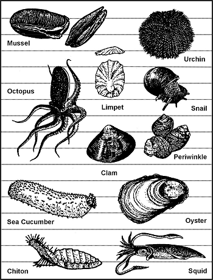
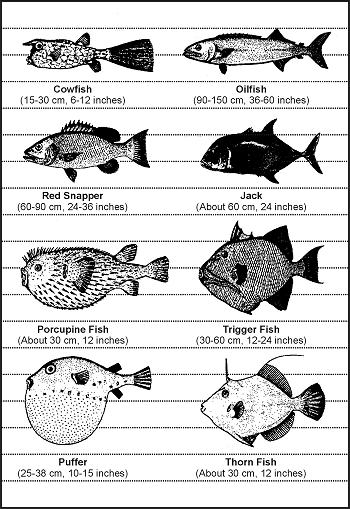
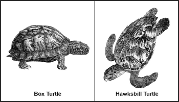

8-1\. Unless you have the chance to take large game, concentrate your efforts on the smaller animals. They are more abundant and easier to prepare. You need not know all the animal species that are suitable as food; relatively few are poisonous, and they make a smaller list to remember. However, it is important to learn the habits and behavioral patterns of classes of animals. For example, animals that are excellent choices for trapping, those that inhabit a particular range and occupy a den or nest, those that have somewhat fixed feeding areas, and those that have trails leading from one area to another. Larger, herding animals, such as elk or caribou, roam vast areas and are somewhat more difficult to trap. Also, you must understand the food choices of a particular species to select the proper bait.

8-2\. You can, with relatively few exceptions, eat anything that crawls, swims, walks, or flies. You must first overcome your natural aversion to a particular food source. Historically, people in starvation situations have resorted to eating everything imaginable for nourishment. A person who ignores an otherwise healthy food source due to a personal bias, or because he feels it is unappetizing, is risking his own survival. Although it may prove difficult at first, you must eat what is available to maintain your health. Some classes of animals and insects may be eaten raw if necessary, but you should, if possible, thoroughly cook all food sources whenever possible to avoid illness.

**INSECTS**

8-3\. The most abundant and easily caught life-form on earth are insects. Many insects provide 65 to 80 percent protein compared to 20 percent for beef. This fact makes insects an important, if not overly appetizing, food source. Insects to avoid include all adults that sting or bite, hairy or brightly colored insects, and caterpillars and insects that have a pungent odor. Also avoid spiders and common disease carriers such as ticks, flies, and mosquitoes.

8-4\. Rotting logs lying on the ground are excellent places to look for a variety of insects including ants, termites, beetles, and grubs, which are beetle larvae. Do not overlook insect nests on or in the ground. Grassy areas, such as fields, are good areas to search because the insects are easily seen. Stones, boards, or other materials lying on the ground provide the insects with good nesting sites. Check these sites. Insect larvae are also edible. Insects that have a hard outer shell such as beetles and grasshoppers will have parasites. Cook them before eating. Remove any wings and barbed legs also. You can eat most soft-shelled insects raw. The taste varies from one species to another. Wood grubs are bland, but some species of ants store honey in their bodies, giving them a sweet taste. You can grind a collection of insects into a paste. You can mix them with edible vegetation. You can cook them to improve their taste.

**WORMS**

8-5\. Worms (_Annelidea_) are an excellent protein source. Dig for them in damp humus soil and in the rootball of grass clumps, or watch for them on the ground after a rain. After capturing them, drop them into clean, potable water for about 15 minutes. The worms will naturally purge or wash themselves out, after which you can eat them raw.

**CRUSTACEANS**

8-6\. Freshwater shrimp range in size from 0.25 centimeter (1/16 inch) up to 2.5 centimeters (1 inch). They can form rather large colonies in mats of floating algae or in mud bottoms of ponds and lakes.

8-7\. Crayfish are akin to marine lobsters and crabs. You can distinguish them by their hard exoskeleton and five pairs of legs, the front pair having oversized pincers. Crayfish are active at night, but you can locate them in the daytime by looking under and around stones in streams. You can also find them by looking in the soft mud near the chimney-like breathing holes of their nests. You can catch crayfish by tying bits of offal or internal organs to a string. When the crayfish grabs the bait, pull it to shore before it has a chance to release the bait.

8-8\. You can find saltwater lobsters, crabs, and shrimp from the surf's edge out to water 10 meters (33 feet) deep. Shrimp may come to a light at night where you can scoop them up with a net. You can catch lobsters and crabs with a baited trap or a baited hook. Crabs will come to bait placed at the edge of the surf, where you can trap or net them. Lobsters and crabs are nocturnal and caught best at night.

**NOTE:** You must cook all freshwater crustaceans, mollusks, and fish. Fresh water tends to harbor many dangerous organisms , animal and human contaminants, and possibly agricultural and industrial pollutants.

**MOLLUSKS**

8-9\. This class includes octopuses and freshwater and saltwater shellfish such as snails, clams, mussels, bivalves, barnacles, periwinkles, chitons, and sea urchins ([Figure 8-1](#fig8-1)). You find bivalves similar to our freshwater mussel and terrestrial and aquatic snails worldwide under all water conditions.

**Figure 8-1\. Edible Mollusks**

8-10\. River snails or freshwater periwinkles are plentiful in rivers, streams, and lakes of northern coniferous forests. These snails may be pencil point or globular in shape.

8-11\. In fresh water, look for mollusks in the shallows, especially in water with a sandy or muddy bottom. Look for the narrow trails they leave in the mud or for the dark elliptical slit of their open valves.

8-12\. Near the sea, look in the tidal pools and the wet sand. Rocks along beaches or extending as reefs into deeper water often bear clinging shellfish. Snails and limpets cling to rocks and seaweed from the low water mark upward. Large snails, called chitons, adhere tightly to rocks above the surf line.

8-13\. Mussels usually form dense colonies in rock pools, on logs, or at the base of boulders.

> **CAUTION**
>
> Mussels may be poisonous in tropical zones during the summer! If a noticeable red tide has occurred within 72 hours, do not eat any fish or shellfish from that water source.

8-14\. Steam, boil, or bake mollusks in the shell. They make excellent stews in combination with greens and tubers.

> **CAUTION**
>
> Do not eat shellfish that are not covered by water at high tide!

**FISH**

8-15\. Fish represent a good source of protein and fat. They offer some distinct advantages to the survivor or evader. They are usually more abundant than mammal wildlife, and the ways to get them are silent. To be successful at catching fish, you must know their habits. For instance, fish tend to feed heavily before a storm. Fish are not likely to feed after a storm when the water is muddy and swollen. Light often attracts fish at night. When there is a heavy current, fish will rest in places where there is an eddy, such as near rocks. Fish will also gather where there are deep pools, under overhanging brush, and in and around submerged foliage, logs, or other objects that offer them shelter.

8-16\. There are no poisonous freshwater fish. However, the common barbel (_Barbus barbus_) is noted to have highly poisonous roe. Catfish species has sharp, needlelike protrusions on its dorsal fins and barbels. These can inflict painful puncture wounds that quickly become infected.

8-17\. Cook all freshwater fish to kill parasites. As a precaution, also cook saltwater fish caught within a reef or within the influence of a freshwater source. Any marine life obtained farther out in the sea will not contain parasites because of the saltwater environment. You can eat these raw.

8-18\. Most fish encountered are edible. The organs of some species are always poisonous to man; other fish can become toxic because of elements in their diets. Ciguatera is a form of human poisoning caused by the consumption of subtropical and tropical marine fish which have accumulated naturally occurring toxins through their diet. These toxins build up in the fish's tissues. The toxins are known to originate from several algae species that are common to ciguatera endemic regions in the lower latitudes. Cooking does not eliminate the toxins; neither does drying, smoking, or marinating. Marine fish most commonly implicated in ciguatera poisoning include the barracudas, jacks, mackerel, triggerfish, snappers, and groupers. Many other species of warm water fishes harbor ciguatera toxins. The occurrence of toxic fish is sporadic, and not all fish of a given species or from a given locality will be toxic. This explains why red snapper and grouper are a coveted fish off the shores of Florida and the East Coast. While they are a restaurant and fisherman's favorite, and a common fish market choice, they can also be associated with 100 cases of food poisonings in May 1988, Palm Beach County, Florida. The poisonings resulted in a statewide warning against eating hogfish, grouper, red snapper, amberjack, and barracuda caught at the Dry Tortuga Bank. A major outbreak of ciguatera occurred in Puerto Rico between April and June 1981 prompting a ban on the sale of barracuda, amberjack, and blackjack. Other examples of poisonous saltwater fish are the porcupine fish, cowfish, thorn fish, oilfish, and puffer ([Figure 8-2](#fig8-2)).

**Figure 8-2\. Fish With Poisonous Flesh**

**AMPHIBIANS**

8-19\. Frogs are easily found around bodies of fresh water. Frogs seldom move from the safety of the water's edge. At the first sign of danger, they plunge into the water and bury themselves in the mud and debris. Frogs are characterized by smooth, moist skin. There are few poisonous species of frogs. Avoid any brightly colored frog or one that has a distinct "X" mark on its back as well as all tree frogs. Do not confuse toads with frogs. Toads may be recognized by their dry, "warty" or bumpy skin. They are usually found on land in drier environments. Several species of toads secrete a poisonous substance through their skin as a defense against attack. Therefore, to avoid poisoning, do not handle or eat toads.

8-20\. Do not eat salamanders; only about 25 percent of all salamanders are edible, so it is not worth the risk of selecting a poisonous variety. Salamanders are found around the water. They are characterized by smooth, moist skin and have only four toes on each foot.

**REPTILES**

8-21\. Reptiles are a good protein source and relatively easy to catch. Thorough cooking and hand washing is imperative with reptiles. All reptiles are considered to be carriers of salmonella, which exists naturally on their skin. Turtles and snakes are especially known to infect man. If you are in an undernourished state and your immune system is weak, salmonella can be deadly. Cook food thoroughly and be especially fastidious washing your hands after handling any reptile. Lizards are plentiful in most parts of the world. They may be recognized by their dry, scaly skin. They have five toes on each foot. The only poisonous ones are the Gila monster and the Mexican beaded lizard. Care must be taken when handling and preparing the iguana and the monitor lizard, as they commonly harbor the salmonellal virus in their mouth and teeth. The tail meat is the best tasting and easiest to prepare.

8-22\. Turtles are a very good source of meat. There are actually seven different flavors of meat in each snapping turtle. Most of the meat will come from the front and rear shoulder area, although a large turtle may have some on its neck. The box turtle ([Figure 8-3](#fig8-3)) is a commonly encountered turtle that you should not eat. It feeds on poisonous mushrooms and may build up a highly toxic poison in its flesh. Cooking does not destroy this toxin. Also avoid the hawksbill turtle ([Figure 8-3](#fig8-3)), found in the Atlantic Ocean, because of its poisonous thorax gland. Poisonous snakes, alligators, crocodiles, and large sea turtles present obvious hazards to the survivor.

**Figure 8-3\. Turtles With Poisonous Flesh**

**BIRDS**

8-23\. All species of birds are edible, although the flavor will vary considerably. The only poisonous bird is the Pitohui, native only to New Guinea. You may skin fish-eating birds to improve their taste. As with any wild animal, you must understand birds' common habits to have a realistic chance of capturing them. You can take pigeons, as well as some other species, from their roost at night by hand. During the nesting season, some species will not leave the nest even when approached. Knowing where and when the birds nest makes catching them easier ([Figure 8-4](#fig8-4)). Birds tend to have regular flyways going from the roost to a feeding area, to water, and so forth. Careful observation should reveal where these flyways are and indicate good areas for catching birds in nets stretched across the flyways ([Figure 8-5](#fig8-5)). Roosting sites and waterholes are some of the most promising areas for trapping or snaring.

|Types of Birds|Frequent Nesting Places|Nesting Periods|
|--------------|-----------------------|---------------|
|Inland birds|Tree, woods or fields|Spring and early summer in temperate and arctic regions; year-round in the tropics|
|Cranes and herons|Mangrove swamps or high trees near water|Spring and early summer|
|Some species of owls|High trees|Late December through March|
|Ducks, geese, and swans|Tundra areas near ponds, rivers or lakes|Spring and early summer in arctic regions|
|Some sea birds|Sandbars or low sand islands|Spring and early summer in temperate and arctic regions|
|Gulls, auks, murres and cormorants|Steep rocky coasts|Spring and early summer in temperate and arctic regions|

**Figure 8-4\. Birds' Nesting Places**

**Figure 8-5\. Catching Birds in a Net**

8-24\. Nesting birds present another food source - eggs. Remove all but two or three eggs from the clutch, marking the ones that you leave. The bird will continue to lay more eggs to fill the clutch. Continue removing the fresh eggs, leaving the ones you marked.

**MAMMALS**

8-25\. Mammals are excellent protein sources and, for Americans, the tastiest food source. There are some drawbacks to obtaining mammals. In a hostile environment, the enemy may detect any traps or snares placed on land. The amount of injury an animal can inflict is in direct proportion to its size. All mammals have teeth and nearly all will bite in self-defense. Even a squirrel can inflict a serious wound and any bite presents a serious risk of infection. Also, any mother can be extremely aggressive in defense of her young. Any animal with no route of escape will fight when cornered.

8-26\. All mammals are edible; however, the polar bear and bearded seal have toxic levels of vitamin A in their livers. The platypus, native to Australia and Tasmania, is an egg-laying, semiaquatic mammal that has poisonous claws on its hind legs. Scavenging mammals, such as the opossum, may carry diseases.
