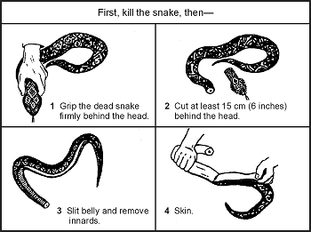
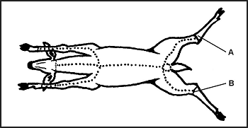
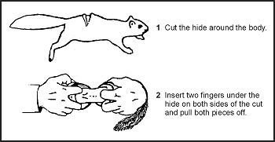
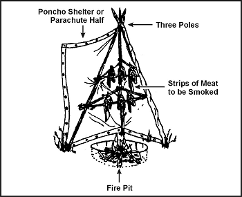
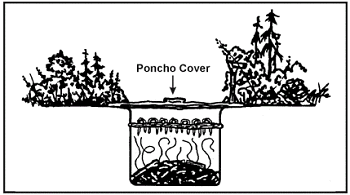

8-70\. You must know how to prepare fish and game for cooking and storage in a survival situation. Improper cleaning or storage can result in inedible fish or game.

**FISH**

8-71\. Do not eat fish that appears spoiled. Cooking does not ensure that spoiled fish will be edible. Signs of spoilage are:
*  Sunken eyes.
*  Peculiar odor.
*  Suspicious color. (Gills should be red to pink. Scales should be a pronounced shade of gray, not faded.)
*  Dents that stay in the fish's flesh after pressed with your thumb.
*  Slimy, rather than moist or wet, body.
*  Sharp or peppery taste.

8-72\. Eating spoiled or rotten fish may cause diarrhea, nausea, cramps, vomiting, itching, paralysis, or a metallic taste in the mouth. These symptoms appear suddenly, 1 to 6 hours after eating. Induce vomiting if symptoms appear.

8-73\. Fish spoils quickly after death, especially on a hot day. Prepare fish for eating as soon as possible after catching it. Cut out the gills and the large blood vessels that lie near the spine. Gut fish that are more than 10 centimeters (4 inches) long. Scale or skin the fish.

8-74\. You can impale a whole fish on a stick and cook it over an open fire. However, boiling the fish with the skin on is the best way to get the most food value. The fats and oil are under the skin and, by boiling, you can save the juices for broth. You can use any of the methods used to cook plant food to cook fish. Pack fish into a ball of clay and bury it in the coals of a fire until the clay hardens. Break open the clay ball to get to the cooked fish. Fish is done when the meat flakes off. If you plan to keep the fish for later, smoke or fry it. To prepare fish for smoking, cut off the head and remove the backbone.

**SNAKES**

8-75\. To skin a snake, first cut off its head, to include 10 to 15 centimeters (4 to 6 inches) behind the head. This will ensure you remove the venom sac, which is located at the base of the head. Bury the sac to prevent further contact. Then cut the skin down the body 2 to 4 centimeters (1 to 1 1/2 inches). Peel the skin back, then grasp the skin in one hand and the body in the other and pull apart ([Figure 8-25](#fig8-25)). On large, bulky snakes it may be necessary to slit the belly skin. Cook snakes in the same manner as small game. Remove the entrails and discard. Cut the snake into small sections and boil or roast it.

**Figure 8-25\. Cleaning a Snake**

**BIRDS**

8-76\. After killing the bird, remove its feathers by either plucking or skinning. Remember, skinning removes some of the food value. Open up the body cavity and remove the entrails, saving the craw (in seed-eating birds), heart, and liver. Cut off the feet. Cook by boiling or roasting over a spit. Before cooking scavenger birds, boil them at least 20 minutes to kill parasites.

**SKINNING AND BUTCHERING GAME**

8-77\. Bleed the animal by cutting its throat. If possible, clean the carcass near a stream. Place the carcass belly up and split the hide from throat to tail, cutting around all sexual organs ([Figure 8-26](#fig8-26)). Remove the musk glands at points A and B to avoid tainting the meat. For smaller mammals, cut the hide around the body and insert two fingers under the hide on both sides of the cut and pull both pieces off ([Figure 8-27](#fig8-27)).

**NOTE:** When cutting the hide, insert the knife blade under the skin and turn the blade up so that only the hide gets cut. This will also prevent cutting hair and getting it on the meat.

**Figure 8-26\. Skinning and Butchering Large Game**

**Figure 8-27\. Skinning Small Game**

8-78\. Remove the entrails from smaller game by splitting the body open and pulling them out with the fingers. Do not forget the chest cavity. For larger game, cut the gullet away from the diaphragm. Roll the entrails out of the body. Cut around the anus, then reach into the lower abdominal cavity, grasp the lower intestine, and pull to remove. Remove the urine bladder by pinching it off and cutting it below the fingers. If you spill urine on the meat, wash it to avoid tainting the meat. Save the heart and liver. Cut these open and inspect for signs of worms or other parasites. Also inspect the liver's color; it could indicate a diseased animal. The liver's surface should be smooth and wet and its color deep red or purple. If the liver appears diseased, discard it. However, a diseased liver does not indicate you cannot eat the muscle tissue.

8-79\. Cut along each leg from above the foot to the previously made body cut. Remove the hide by pulling it away from the carcass, cutting the connective tissue where necessary. Cut off the head and feet.

8-80\. Cut larger game into manageable pieces. First, slice the muscle tissue connecting the front legs to the body. There are no bones or joints connecting the front legs to the body on four-legged animals. Cut the hindquarters off where they join the body. You must cut around a large bone at the top of the leg and cut to the ball-and-socket hip joint. Cut the ligaments around the joint and bend it back to separate it. Remove the large muscles (the tenderloin or "backstrap") that lie on either side of the spine. Separate the ribs from the backbone. There is less work and less wear on your knife if you break the ribs first, then cut through the breaks.

8-81\. Boil large meat pieces or cook them over a spit. You can stew or boil smaller pieces, particularly those that remain attached to bone after the initial butchering, as soup or broth. You can cook body organs such as the heart, liver, pancreas, spleen, and kidneys using the same methods as for muscle meat. You can also cook and eat the brain. Cut the tongue out, skin it, boil it until tender, and eat it.

**SMOKING MEAT**

8-82\. To smoke meat, prepare an enclosure around a fire [Figure 8-28](#fig8-28)). Two ponchos snapped together will work. The fire does not need to be big or hot. The intent is to produce smoke and heat, not flame. Do not use resinous wood because its smoke will ruin the meat. Use hardwoods to produce good smoke. The wood should be somewhat green. If it is too dry, soak it. Cut the meat into thin slices, no more than 6 millimeters (about 1/4 inch) thick, and drape them over a framework. Make sure none of the meat touches another piece. Keep the poncho enclosure around the meat to hold the smoke and keep a close watch on the fire. Do not let the fire get too hot. Meat smoked overnight in this manner will last about 1 week. Two days of continuous smoking will preserve the meat for 2 to 4 weeks. Properly smoked meat will look like a dark, curled, brittle stick and you can eat it without further cooking. You can also use a pit to smoke meat ([Figure 8-29](#fig8-29)).

**Figure 8-28\. Tepee Smoker**

**Figure 8-29\. Smoking Meat Over a Pit**

**DRYING MEAT**

8-83\. To preserve meat by drying, cut it into 6-millimeter (1/4-inch) strips with the grain. Hang the meat strips on a rack in a sunny location with good airflow. Keep the strips out of the reach of animals. Cover the strips to keep off blowflies. Allow the meat to dry thoroughly before eating. Properly dried meat will have a dry, crisp texture and will not feel cool to the touch.

**OTHER PRESERVATION METHODS**

8-84\. You can also preserve meats using the freezing or brine and salt methods. In cold climates, you can freeze and keep meat indefinitely. Freezing is not a means of preparing meat. You must still cook it before eating. You can also preserve meat by soaking it thoroughly in a saltwater solution. The solution must cover the meat. You can use salt by itself but make sure you wash off the salt before cooking.
** *