8-27\. For an unarmed survivor or evader, or when the sound of a rifle shot could be a problem, trapping or snaring wild game is a good alternative. Several well-placed traps have the potential to catch much more game than a man with a rifle is likely to shoot. To be effective with any type of trap or snare, you must:
*  Be familiar with the species of animal you intend to catch.
*  Be capable of constructing a proper trap and properly masking your scent.
*  Not alarm the prey by leaving signs of your presence.

8-28\. There are no catchall traps you can set for all animals. You must determine what species are in the area and set your traps specifically with those animals in mind. Look for the following:
*  Runs and trails.
*  Tracks.
*  Droppings.
*  Chewed or rubbed vegetation.
*  Nesting or roosting sites.
*  Feeding and watering areas.

8-29\. Position your traps and snares where there is proof that animals pass through. You must determine if it is a "run" or a "trail." A trail will show signs of use by several species and will be rather distinct. A run is usually smaller and less distinct and will only contain signs of one species. You may construct a perfect snare, but it will not catch anything if haphazardly placed in the woods. Animals have bedding areas, water holes, and feeding areas with trails leading from one to another. You must place snares and traps around these areas to be effective.

8-30\. If you are in a hostile environment, trap and snare concealment is important. However, it is equally important not to create a disturbance that will alarm the animal and cause it to avoid the trap. Therefore, if you must dig, remove all fresh dirt from the area. Most animals will instinctively avoid a pitfall-type trap. Prepare the various parts of a trap or snare away from the site, carry them in, and set them up. Such actions make it easier to avoid disturbing the local vegetation, thereby alerting the prey. Do not use freshly cut, live vegetation to construct a trap or snare. Freshly cut vegetation will "bleed" sap that has an odor the prey will be able to smell. It is an alarm signal to the animal.

8-31\. You must remove or mask the human scent on and around the trap you set. Although birds do not have a developed sense of smell, nearly all mammals depend on smell even more than on sight. Even the slightest human scent on a trap will alarm the prey and cause it to avoid the area. Actually removing the scent from a trap is difficult but masking it is relatively easy. Use the fluid from the gall and urine bladders of previous kills. Do not use human urine. Mud, particularly from an area with plenty of rotting vegetation, is also good. Use it to coat your hands when handling the trap and to coat the trap when setting it. In nearly all parts of the world, animals know the smell of burned vegetation and smoke. It is only when a fire is actually burning that they become alarmed. Therefore, smoking the trap parts is an effective means to mask your scent. If one of the above techniques is not practical, and if time permits, allow a trap to weather for a few days and then set it. Do not handle a trap while it is weathering. When you position the trap, camouflage it as naturally as possible to prevent detection by the enemy and to avoid alarming the prey.

8-32\. Traps or snares placed on a trail or run should use funneling or channelization. To build a channel, construct a funnel-shaped barrier extending from the sides of the trail toward the trap, with the narrowest part nearest the trap. Channelization should be inconspicuous to avoid alerting the prey. As the animal gets to the trap, it cannot turn left or right and continues into the trap. Few wild animals will back up, preferring to face the direction of travel. Channelization does not have to be an impassable barrier. You only have to make it inconvenient for the animal to go over or through the barrier. For best effect, the channelization should reduce the trail's width to just slightly wider than the targeted animal's body. Maintain this constriction at least as far back from the trap as the animal's body length, then begin the widening toward the mouth of the funnel.

**USE OF BAIT**

8-33\. Baiting a trap or snare increases your chances of catching an animal. When catching fish, you must bait nearly all the devices. Success with an unbaited trap depends on its placement in a good location. A baited trap can actually draw animals to it. The bait should be something the animal knows. However, this bait should not be so readily available in the immediate area that the animal can get it close by. For example, baiting a trap with corn in the middle of a cornfield would not be likely to work. Likewise, if corn is not grown in the region, a corn-baited trap may arouse an animal's curiosity and keep it alerted while it ponders the strange food. Under such circumstances it may not go for the bait. One bait that works well on small mammals is the peanut butter from a meal, ready-to-eat (MRE) ration. Salt is also a good bait. When using such baits, scatter bits of it around the trap to give the prey a chance to sample it and develop a craving for it. The animal will then overcome some of its caution before it gets to the trap.

8-34\. If you set and bait a trap for one species but another species takes the bait without being caught, try to determine what the animal was. Then set a proper trap for that animal, using the same bait.

**NOTE:** Once you have successfully trapped an animal, you will not only gain confidence in your ability, you will also have resupplied yourself with bait for several more traps.

**CONSTRUCTION**

8-35\. Traps and snares _crush, choke, hang,_ or _entangle_ the prey. A single trap or snare will commonly incorporate two or more of these principles. The mechanisms that provide power to the trap are usually very simple. The struggling victim, the force of gravity, or a bent sapling's tension provides the power.

8-36\. The heart of any trap or snare is the trigger. When planning a trap or snare, ask yourself how it should affect the prey, what is the source of power, and what will be the most efficient trigger. Your answers will help you devise a specific trap for a specific species. Traps are designed to catch and hold or to catch and kill. Snares are traps that incorporate a noose to accomplish either function.

**Simple Snare**

8-37\. A simple snare ([Figure 8-6](#fig8-6)) consists of a noose placed over a trail or den hole and attached to a firmly planted stake. If the noose is some type of cordage placed upright on a game trail, use small twigs or blades of grass to hold it up. Filaments from spider webs are excellent for holding nooses open. Make sure the noose is large enough to pass freely over the animal's head. As the animal continues to move, the noose tightens around its neck. The more the animal struggles, the tighter the noose gets. This type of snare usually does not kill the animal. If you use cordage, it may loosen enough to slip off the animal's neck. Wire is therefore the best choice for a simple snare.

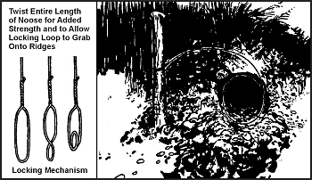

**Figure 8-6\. Simple Snare**

**Drag Noose**

8-38\. Use a drag noose on an animal run ([Figure 8-7](#fig8-7)). Place forked sticks on either side of the run and lay a sturdy crossmember across them. Tie the noose to the crossmember and hang it at a height above the animal's head. (Nooses designed to catch by the head should never be low enough for the prey to step into with a foot.) As the noose tightens around the animal's neck, the animal pulls the crossmember from the forked sticks and drags it along. The surrounding vegetation quickly catches the crossmember and the animal becomes entangled.

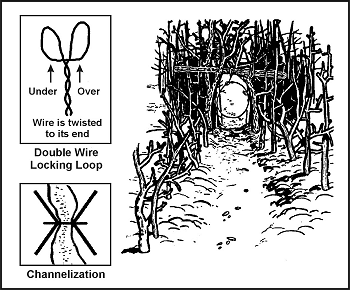

**Figure 8-7\. Drag Noose**

**Twitch-Up**

8-39\. A twitch-up is a supple sapling that, when bent over and secured with a triggering device, will provide power to a variety of snares. Select a hickory or other hardwood sapling along the trail. A twitch-up will work much faster and with more force if you remove all the branches and foliage.

**Twitch-Up Snare**

8-40\. A simple twitch-up snare uses two forked sticks, each with a long and short leg ([Figure 8-8](#fig8-8)). Bend the twitch-up and mark the trail below it. Drive the long leg of one forked stick firmly into the ground at that point. Ensure the cut on the short leg of this stick is parallel to the ground. Tie the long leg of the remaining forked stick to a piece of cordage secured to the twitch-up. Cut the short leg so that it catches on the short leg of the other forked stick. Extend a noose over the trail. Set the trap by bending the twitch-up and engaging the short legs of the forked sticks. When an animal catches its head in the noose, it pulls the forked sticks apart, allowing the twitch-up to spring up and hang the prey.

**NOTE:** Do not use green sticks for the trigger. The sap that oozes out could glue them together.

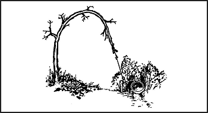

**Figure 8-8\. Twitch-Up Snare**

**Squirrel Pole**

8-41\. A squirrel pole is a long pole placed against a tree in an area showing a lot of squirrel activity ([Figure 8-9](#fig8-9)). Place several wire nooses along the top and sides of the pole so that a squirrel trying to go up or down the pole will have to pass through one or more of them. Position the nooses (5 to 6 centimeters [2 to 2 1/4-inches] in diameter) about 2.5 centimeters (1 inch) off the pole. Place the top and bottom wire nooses 45 centimeters (18 inches) from the top and bottom of the pole to prevent the squirrel from getting its feet on a solid surface. If this happens, the squirrel will chew through the wire. Squirrels are naturally curious. After an initial period of caution, they will try to go up or down the pole and will be caught in the noose. The struggling animal will soon fall from the pole and strangle. Other squirrels will soon be drawn to the commotion. In this way, you can catch several squirrels. You can emplace multiple poles to increase the catch.

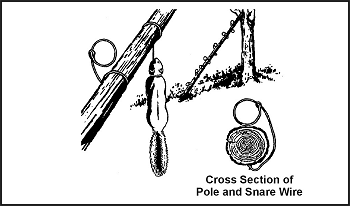

**Figure. 8-9\. Squirrel Pole**

**Ojibwa Bird Pole**

8-42\. An Ojibwa bird pole is a snare that has been used by Native Americans for centuries ([Figure 8-10](#fig8-10)). To be effective, it should be placed in a relatively open area away from tall trees. For best results, pick a spot near feeding areas, dusting areas, or watering holes. Cut a pole 1.8 to 2.1 meters (6 to 7 feet) long and trim away all limbs and foliage. Do not use resinous wood such as pine. Sharpen the upper end to a point, then drill a small-diameter hole 5 to 7.5 centimeters (2 to 3 inches) down from the top. Cut a small stick 10 to 15 centimeters (4 to 6 inches) long and shape one end so that it will almost fit into the hole. This is the perch. Plant the long pole in the ground with the pointed end up. Tie a small weight, about equal to the weight of the targeted species, to a length of cordage. Pass the free end of the cordage through the hole, and tie a slip noose that covers the perch. Tie a single overhand knot in the cordage and place the perch against the hole. Allow the cordage to slip through the hole until the overhand knot rests against the pole and the top of the perch. The tension of the overhand knot against the pole and perch will hold the perch in position. Spread the noose over the perch, ensuring it covers the perch and drapes over on both sides. Most birds prefer to rest on something above ground and will land on the perch. As soon as the bird lands, the perch will fall, releasing the overhand knot and allowing the weight to drop. The noose will tighten around the bird's feet, capturing it. If the weight is too heavy, it will cut off the bird's feet, allowing it to escape. Another variation would be to use spring tension such as a tree branch in place of the weight.

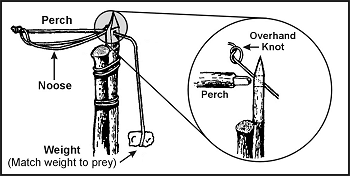

**Figure 8-10\. Ojibwa Bird Pole**

**Noosing Wand**

8-43\. A noose stick or "noosing wand" is useful for capturing roosting birds or small mammals ([Figure 8-11](#fig8-11)). It requires a patient operator. This wand is more a weapon than a trap. It consists of a pole (as long as you can effectively handle) with a slip noose of wire or stiff cordage at the small end. To catch an animal, you slip the noose over the neck of a roosting bird and pull it tight. You can also place it over a den hole and hide in a nearby blind. When the animal emerges from the den, you jerk the pole to tighten the noose and thus capture the animal. Carry a stout club to kill the prey.

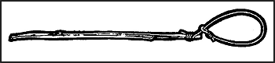

**Figure 8-11\. Noosing Wand**

**Treadle Spring Snare**

8-44\. Use a treadle snare against small game on a trail ([Figure 8-12](#fig8-12)). Dig a shallow hole in the trail. Then drive a forked stick (fork down) into the ground on each side of the hole on the same side of the trail. Select two fairly straight sticks that span the two forks. Position these two sticks so that their ends engage the forks. Place several sticks over the hole in the trail by positioning one end over the lower horizontal stick and the other on the ground on the other side of the hole. Cover the hole with enough sticks so that the prey must step on at least one of them to set off the snare. Tie one end of a piece of cordage to a twitch-up or to a weight suspended over a tree limb. Bend the twitch-up or raise the suspended weight to determine where you will tie the trigger. The trigger should be about 5 centimeters (2 inches) long. Form a noose with the other end of the cordage. Route and spread the noose over the top of the sticks over the hole. Place the trigger stick against the horizontal sticks and route the cordage behind the sticks so that the tension of the power source will hold it in place. Adjust the bottom horizontal stick so that it will barely hold against the trigger. As the animal places its foot on a stick across the hole, the bottom horizontal stick moves down, releasing the trigger and allowing the noose to catch the animal by the foot. Because of the disturbance on the trail, an animal will be wary. You must therefore use channelization. To increase the effectiveness of this trap, a small bait well may be dug into the bottom of the hole. Place some bait in the bottom of the hole to lure the animal to the snare.

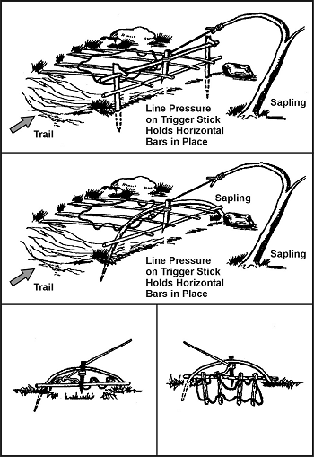

**Figure 8-12\. Treadle Spring Snare**

**Figure 4 Deadfall**

8-45\. The figure 4 deadfall is a trigger used to drop a weight onto a prey and crush it ([Figure 8-13](#fig8-13)). The type of weight used may vary, but it should be heavy enough to kill or incapacitate the prey immediately. Construct the figure 4 using three notched sticks. These notches hold the sticks together in a figure 4 pattern when under tension. Practice making this trigger beforehand; it requires close tolerances and precise angles in its construction.

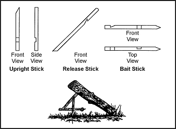

**Figure 8-13\. Figure 4 Deadfall**

**Paiute Deadfall**

8-46\. The Paiute deadfall is similar to the figure 4 but uses a piece of cordage and a catch stick ([Figure 8-14](#fig8-14)). It has the advantage of being easier to set than the figure 4\. Tie one end of a piece of cordage to the lower end of the diagonal stick. Tie the other end of the cordage to another stick about 5 centimeters (2 inches) long. This stick is the catch stick. Bring the cord halfway around the vertical stick with the catch stick at a 90-degree angle. Place the bait stick with one end against the drop weight, or a peg driven into the ground, and the other against the catch stick. When a prey disturbs the bait stick, it falls free, releasing the catch stick. As the diagonal stick flies up, the weight falls, crushing the prey. To increase the effectiveness of this trap, a small bait well may be dug into the bottom of the hole. Place some bait in the bottom of the hole to lure the animals to the snare.

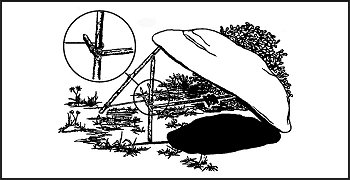

**Figure 8-14\. Paiute Deadfall**

**Bow Trap**

8-47\. A bow trap is one of the deadliest traps ([Figure 8-15](#fig8-15)). It is dangerous to man as well as animals. To construct this trap, build a bow and anchor it to the ground with pegs. Adjust the aiming point as you anchor the bow. Lash a toggle stick to the trigger stick. Two upright sticks driven into the ground hold the trigger stick in place at a point where the toggle stick will engage the pulled bowstring. Place a catch stick between the toggle stick and a stake driven into the ground. Tie a trip wire or cordage to the catch stick and route it around stakes and across the game trail where you tie it off (as in [Figure 8-15](#fig8-15)). When the prey trips the trip wire, the bow looses an arrow into it. A notch in the bow serves to help aim the arrow.

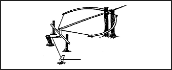

**Figure 8-15\. Bow Trap**

> **WARNING**
>
> This is a lethal trap. Approach it with caution and from the rear only!

**Pig Spear Shaft**

8-48\. To construct the pig spear shaft, select a stout pole about 2.5 meters (8 feet) long ([Figure 8-16](#fig8-16)). At the smaller end, firmly lash several small stakes. Lash the large end tightly to a tree along the game trail. Tie a length of cordage to another tree across the trail. Tie a sturdy, smooth stick to the other end of the cord. From the first tree, tie a trip wire or cord low to the ground, stretch it across the trail, and tie it to a catch stick. Make a slip ring from vines or other suitable material. Encircle the trip wire and the smooth stick with the slip ring. Emplace one end of another smooth stick within the slip ring and its other end against the second tree. Pull the smaller end of the spear shaft across the trail and position it between the short cord and the smooth stick. As the animal trips the trip wire, the catch stick pulls the slip ring off the smooth sticks, releasing the spear shaft that springs across the trail and impales the prey against the tree.

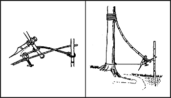

**Figure 8-16\. Pig Spear Shaft**

> **WARNING**
>
> This is a lethal trap. Approach it with caution and from the rear only!

**Bottle Trap**

8-49\. A bottle trap is a simple trap for mice and voles ([Figure 8-17](#fig8-17)). Dig a hole 30 to 45 centimeters (12 to 18 inches) deep that is wider at the bottom than at the top. Make the top of the hole as small as possible. Place a piece of bark or wood over the hole with small stones under it to hold it up 2.5 to 5 centimeters (1 to 2 inches) off the ground. Mice or voles will hide under the cover to escape danger and fall into the hole. They cannot climb out because of the wall's backward slope. Use caution when checking this trap; it is an excellent hiding place for snakes.

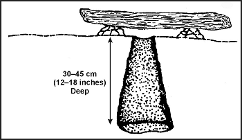

**Figure 8-17\. Bottle Trap**
