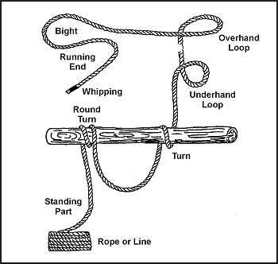

To be able to construct shelters, traps and snares, weapons and tools, and other devices; you should have a basic knowledge of ropes and knots and some of the terminology used with them. The terms are as follows:

* _Bight_. A simple bend of rope in which the rope does not cross itself.
* _Dressing the knot_. The orientation of all knot parts so that they are properly aligned, straightened, or bundled. Neglecting this can result in an additional 50 percent reduction in knot strength. This term is sometimes used for setting the knot which involves tightening all parts of the knot so they bind on one another and make the knot operational. A loosely tied knot can easily deform under strain and change, becoming a slipknot or worse, untying.
* _Fraps_. A means of tightening the lashings by looping the rope perpendicularly around the wraps that hold the spars or sticks together.
* _Lashings_. A means of using wraps and fraps to tie two or three spars or sticks together to form solid corners or to construct tripods. Lashings begin and end with clove hitches.
* _Lay_. The lay of the rope is the same as the twist of the rope.
* _Loop_. A loop is formed by crossing the running end over or under the standing end to form a ring or circle in the rope.
* _Pig tail_. That part of the running end that is left after tying the knot. It should be no more than 4 inches long to conserve rope and prevent interference.
* _Running end_. The free or working end of a rope. This is the part of the rope you are actually using to tie the knot.
* _Standing end_. The static part of rope or rest of the rope besides the running end.
* _Turn_. A loop around an object such as a post, rail, or ring with the running end continuing in the opposite direction to the standing end. A round turn continues to circle and exits in the same general direction as the standing end.
* _Whipping_. Any method of preventing the end of a rope from untwisting or becoming unwound. It is done by wrapping the end tightly with a small cord, tape or other means. It should be done on both sides of an anticipated cut in a rope, before cutting the rope in two. This prevents the rope from immediately untwisting.
* _Wraps_ ([Figure G-1](#figg-1)). Simple wraps of rope around two poles or sticks (square lashing) or three poles or sticks (tripod lashing). Wraps begin and end with clove hitches and get tighter with fraps. All together, they form a lashing.

**Figure G-1\. Wraps**
