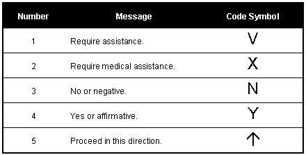
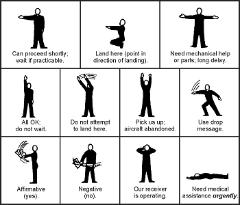
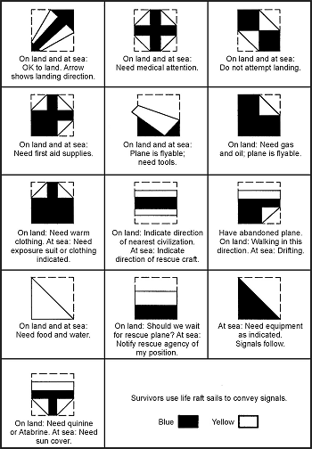

19-37\. Now that you know how to let people know where you are, you need to know how to give them more information. It is easier to form one symbol than to spell out an entire message. Therefore, learn the codes and symbols that all aircraft pilots understand.

**SOS**

19-38\. You can use lights or flags to send an SOS-three dots, three dashes, three dots. The SOS is the internationally recognized distress signal in radio Morse code. A dot is a short, sharp pulse; a dash is a longer pulse. Keep repeating the signal. When using flags, hold flags on the left side for dashes and on the right side for dots.

**GROUND-TO-AIR EMERGENCY CODE**

19-39\. This code ([Figure 19-6](#fig19-6)) is actually five definite, meaningful symbols. Make these symbols a minimum of 4 meters (13 feet) wide and 6 meters (20 feet) long. If you make them larger, keep the same 2:3 ratio. The signal arms or legs should be 1 meter (3 feet) wide and 1 meter (3 feet) high to ensure maximum visibility from high altitudes. Ensure the signal contrasts greatly with the ground it is on. The signal may be constructed from any available materials; for example, aircraft parts, logs, or leaves. Remember size, ratio, angularity, straight lines, and square corners are not found in nature. You must consider how the signal will contrast with the natural background. The signal may be made by breaking and bending over crops or tall grass in a field or trampled down into snow or sandy soil. Place it in an open area easily spotted from the air. If evading, the signal could also be dug into the ground to reduce its signature from ground forces.

**Figure 19-6\. Ground-to-Air Emergency Code (Pattern Signals)**

**BODY SIGNALS**

19-40\. When an aircraft is close enough for the pilot to see you clearly, use body movements or positions ([Figure 19-7](#fig19-7)) to convey a message.

**Figure 19-7\. Body Signals**

**PANEL SIGNALS**

19-41\. If you have a life raft cover or sail, or a suitable substitute such as a space blanket or combat casualty blanket, use the symbols shown in [Figure 19-8](#fig19-8) to convey a message.

**Figure 19-8\. Panel Signals**

**AIRCRAFT ACKNOWLEDGMENTS**

19-42\. Once the pilot of a fixed-wing aircraft has sighted you, he will normally indicate he has seen you by flying low, moving the plane, and flashing lights as shown in [Figure 19-9](#fig19-9). Be ready to relay other messages to the pilot once he acknowledges that he received and understood your first message. Use a radio, if possible, to relay further messages. If no radio is available, use the codes covered in the previous paragraphs.

**Figure 19-9\. Aircraft Acknowledgments**
