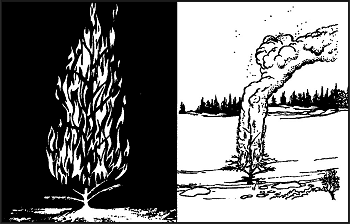
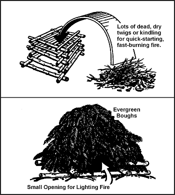
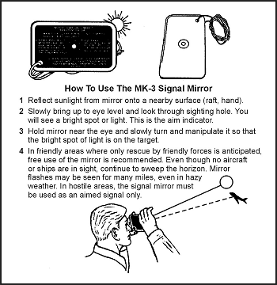
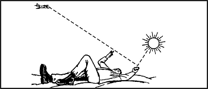
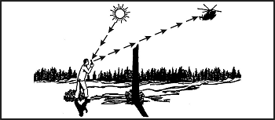

19-5\. There are two main ways to get attention or to communicate-visual and audio. The means you use will depend on your situation and the material you have available. Whatever the means, always have visual and audio signals ready for use. Throughout this chapter you will see references to "groups of threes." This is because nature does not normally replicate anything in groups of three. "Things in threes" tend more often to be manmade sounds or visual signals.

**VISUAL SIGNALS**

19-6\. These signals are materials or equipment you use to make your presence known to rescuers. Visual signals can include fire, smoke, flares, and many other means of signaling.

**Fire**

19-7\. During darkness, fire is an effective visual means for signaling. Build three fires in a triangle (the international distress signal) or in a straight line with about 25 meters (83 feet) between the fires. Build them as soon as time and the situation permit and protect them from the elements until you need them. If you are alone, maintaining three fires may be difficult. If so, maintain one signal fire. The hot coal bed left by a fire also may be seen by aerial platforms that are equipped to detect infrared or thermal signatures.

19-8\. When constructing signal fires, consider your geographic location. If in a jungle, find a natural clearing or the edge of a stream where you can build fires that the jungle foliage will not hide. You may even have to clear an area. If in a snow-covered area, you may have to clear the ground of snow or make a platform on which to build the fire so that melting snow will not extinguish it.

19-9\. A burning tree (tree torch) is another way to attract attention ([Figure 19-1](#fig19-1)). You can set pitch-bearing trees afire, even when green. You can get other types of trees to burn by placing dry wood in the lower branches and igniting it so that the flames flare up and ignite the foliage. Before the primary tree is consumed, cut and add more small green trees to the fire to produce more smoke. Always select an isolated tree so that you do not start a forest fire and endanger yourself.

**Figure 19-1\. Tree Torch**

**Smoke**

19-10\. During daylight, build a smoke generator and use smoke to gain attention ([Figure 19-2](#fig19-2)). The international distress signal is three columns of smoke. Try to create a color of smoke that contrasts with the background; dark smoke against a light background and vice versa. If you practically smother a large fire with green leaves, moss, or a little water, the fire will produce white smoke. If you add rubber or oil-soaked rags to a fire, you will get black smoke.

**Figure 19-2\. Smoke Generator-Ground**

19-11\. In a desert environment, smoke hangs close to the ground, but a pilot can spot it in open desert terrain.

19-12\. Smoke signals are effective only on comparatively calm, clear days. High winds, rain, or snow disperse smoke, lessening its chances of being seen.

**Smoke Grenades**

19-13\. If you have smoke grenades with you, use them in the same pattern as described for fires. Keep them dry so that they will work when you need them. Take care not to ignite the vegetation in the area when you use them. Red is an internationally recognized color of distress, but any color smoke, if properly used, will attract attention.

**Pen Flares**

19-14\. The M185 signal device is part of an aviator's survival vest. The device consists of a pen-shaped gun with a flare attached by a nylon cord. When fired, the pen flare sounds like a pistol shot and fires the flare about 150 meters (495 feet) high. It is about 3 centimeters (1 inch) in diameter.

19-15\. To have the pen flare ready for immediate use, take it out of its wrapper, partially screw on the flare, leave the gun uncocked, and drape the cord around your neck. Be ready to fire it well in front of search aircraft in a nonthreatening direction and be ready with a secondary signal. Also, be ready to take cover in case the pilot mistakes the flare for enemy fire. It is important to note that pen flares may deflect off tree limbs and tree canopies. This may cause the flare to deflect or shoot back to the ground, causing a forest fire hazard. Ensure you have proper overhead clearance and an obstacle-free path to shoot through.

**Gyro-Jets**

19-16\. These devices are the newer version of the pen flare. They differ in that they are jet-powered rather than ballistic like the pen flares. They will reach a height of up to 300 meters (990 feet). To prepare them for firing, the flares are pushed until firmly seated into a crimped collar rather than a threaded screw-on type assembly. They are designed to better penetrate tree canopies, but do not rely on this to always happen. Always ensure you have a clear path in which to aim and fire all overhead pyrotechnics. Again, groups of threes are internationally recognized symbols of distress.

**Tracer Ammunition**

19-17\. You may use rifle or pistol tracer ammunition to signal search aircraft. **Do not** fire the ammunition in front of the aircraft. As with pen flares, be ready to take cover if the pilot mistakes your tracers for enemy fire. Again, groups of threes are internationally recognized symbols of distress.

**Star Clusters**

19-18\. Red is the international distress color; therefore, use a red star cluster whenever possible. However, any color will let your rescuers know where you are. Star clusters reach a height of 200 to 215 meters (660 to 710 feet), burn an average of 6 to 10 seconds, and descend at a rate of 14 meters (46 feet) per second.

**Star Parachute Flares**

19-19\. These flares reach a height of 200 to 215 meters (660 to 710 feet) and descend at a rate of 2.1 meters (7 feet) per second. The M126 (red) burns about 50 seconds and the M127 (white) about 25 seconds. At night you can see these flares at 48 to 56 kilometers (30 to 34 miles).

**MK-13 and MK-124**

19-20\. These signals are normally found on aircraft and lift rafts. They produce an orange smoke on one end for day signaling and a flare on the other end for nighttime use. The smoke lasts for approximately 15 seconds and the flare lasts 20 to 25 seconds. Though the signal is designed for use on a life raft, they do not float. They are designed to be handheld, but hold the device by the far end that is not being used to prevent burns. Note that after expending either signal the other end is still available for use, so do not discard it until both ends have been used. There are numerous redundant markings on each side of the flare to ensure that you activate the correct signal, day or night. The end caps are colored, raised protrusions or nipples are present, and a washer is on the pull ring to differentiate night and day.

**Mirrors or Shiny Objects**

19-21\. On a sunny day, a mirror is your best signaling device. If you don't have a mirror, polish your canteen cup, your belt buckle, or a similar object that will reflect the sun's rays. Direct the flashes in one area so that they are secure from enemy observation. Practice using a mirror or shiny object for signaling **now**; do not wait until you need it. If you have an MK-3 signal mirror, follow the instructions on its back ([Figure 19-3](#fig19-3)). An alternate, easier method of aiming the signal mirror is to catch the reflection on the palm of your hand or in between two fingers held up in a "V" or "peace sign." Now slowly move your hand so that it is just below your aim point or until the aircraft is between the "V" in your fingers, keeping the glare on your palm. Then move the mirror slowly and rhythmically up and down off your hand and onto the aim point as in [Figures 19-4](#fig19-4) and [19-5](#fig19-5).

**Figure 19-3\. MK-3 Signal Mirror**

**Figure 19-4\. Aiming an Improvised Signal Mirror**

**Figure 19-5\. Aiming an Improvised Signal Mirror Using a Stationary Object**

19-22\. Wear the signal mirror on a cord or chain around your neck so that it is ready for immediate use. However, be sure the glass side is against your body so that it will not flash; the enemy can see the flash.

19-23\. Haze, ground fog, and mirages may make it hard for a pilot to spot signals from a flashing object. So, if possible, get to the highest point in your area when signaling. If you can't determine the aircraft's location, flash your signal in the direction of the aircraft noise.

**NOTE:** Pilots have reported seeing mirror flashes up to 160 kilometers (96 miles) away under ideal conditions.

**Flashlight or Strobe Light**

19-24\. At night you can use a flashlight or a strobe light to send an SOS to an aircraft. When using a strobe light, take care to prevent the pilot from mistaking it for incoming ground fire. The strobe light flashes 60 times per minute. Some strobe lights have infrared covers and lenses. Blue flash collimators are also available for strobe lights that aid in distinguishing the flashing of the strobe light from a muzzle flash, and also make the strobe light directional.

**Laser Devices**

19-25\. Laser aiming devices on weapons systems are highly visible. So are targeting pointers and many commercial types of laser presentation pointers.

**Firefly Lights**

19-26\. These small lights, about 3 centimeters (1 1/4 inches) square and 1 centimeter (1/8 inch) thick, snap onto 9-volt batteries. They are available in a variety of visible and infrared, blinking and steady light versions. The visible range and battery duration will depend on the intensity of the bulb and the mode each light uses. Other models incorporate a 4-second programmable memory that allows users to input any particular code they wish.

**VS-17 Panel**

19-27\. During daylight you can use a VS-17 panel to signal. Place the orange side up as it is easier to see from the air than the violet side. Flashing the panel will make it easier for the aircrew to spot. You can use any bright orange or violet cloth as a substitute for the VS-17.

**Clothing**

19-28\. Spreading clothing on the ground or in the top of a tree is another way to signal. Select articles whose color will contrast with the natural surroundings. Arrange them in a large geometric pattern to make them more likely to attract attention.

**Natural Material**

19-29\. If you lack other means, you can use natural materials to form a symbol or message that can be seen from the air. Build mounds that cast shadows; you can use brush, foliage of any type, rocks, or snow blocks.

19-30\. In snow-covered areas, tramp the snow to form letters or symbols and fill the depression with contrasting material (twigs or branches). In sand, use boulders, vegetation, or seaweed to form a symbol or message. In brush-covered areas, cut out patterns in the vegetation or sear the ground. In tundra, dig trenches or turn the sod upside down.

19-31\. In any terrain, use contrasting materials that will make the symbols visible to the aircrews. Orient the signal in a north-south fashion to attain the maximum benefit of the sun's shadow for contrast and recognition.

**Sea Dye Markers**

19-32\. All aircraft involved in operations near or over water will normally carry a water survival kit that contains sea dye markers. If you are in a water survival situation, use sea dye markers during daylight to indicate your location. These spots of dye stay conspicuous for about 3 hours, except in very rough seas. Use them only if you are in a friendly area. Keep the markers wrapped until you are ready to use them. The sea dye is visible at a distance of more than 11 kilometers (7 miles) from an aircraft at 2,000 feet, so you should use them only when you hear or sight an aircraft. To further conserve them do not use them all at once. Dip the marker bag in the water until a slick about 30 meters (100 feet) appears. Sea dye markers are also very effective on snow-covered ground; use them to write distress code letters.

**NOTE:** Rumors have persisted about how sea dye attracts sharks. The U.S. Navy has conducted research, and no scientific data has been found to support this rumor. Sharks are naturally curious and are drawn to strange objects in their area. Therefore, a shark may investigate a person, with or without sea dye, as a possible food source. Do not be afraid to use sea dye markers; it may be your last or only chance to signal a rescue aircraft.

**AUDIO SIGNALS**

19-33\. Your other means of signaling a rescuer can be audio signals. Radios, whistles, and gunshots are some of the methods you can use to signal your location.

**Radio Equipment**

19-34\. The AN/PRC-90 survival radio is a part of the Army aviator's survival vest. The AN/PRC-112 will eventually replace the AN/PRC-90\. Both radios can transmit either tone or voice. Any other type of Army radio can do the same. The ranges of the different radios vary depending on the altitude of the receiving aircraft, terrain, vegetation density, weather, battery strength, type of radio, and interference. To obtain maximum performance from radios, use the following procedures:

*  Try to transmit only in clear, unobstructed terrain. Since radios are line-of-sight communications devices, any terrain between the radio and the receiver will block the signal.
*  Keep the antenna at right angles to the rescuing aircraft. There is little or no signal strength emanating from the tip of the antenna.
*  If the radio has tone capability, place it upright on a flat, elevated surface so that you can perform other survival tasks.
*  Never let any part of the antenna or its mounting lug touch your clothing, body, foliage, or the ground. Such contact greatly reduces the range of the signal.
*  Conserve battery power. Turn the radio off when you are not using it. Do not transmit or receive constantly. In hostile territory, keep transmissions short to avoid enemy radio direction finding.
*  In cold weather, keep the battery inside your clothing when not using the radio. Cold quickly drains the battery's power. Do not expose the battery to extreme heat such as desert sun. High heat may cause the battery to explode. The radio is designed to be waterproof, but always try to keep the radio and battery as dry as possible, as water may destroy the circuitry.
*  A worldwide satellite monitoring system has been developed by international search and rescue agencies to assist in locating survivors. To activate this search and rescue satellite-aided tracking (SARSAT) system in peacetime, key the transmitter for a minimum of 30 seconds.

**Whistles**

19-35\. Whistles provide an excellent way for close-up signaling. In some documented cases, they have been heard up to 1.6 kilometers (3/4 mile) away. Manufactured whistles have more range than a human whistle.

**Gunshots**

19-36\. In some situations you can use firearms for signaling. Three shots fired at distinct intervals usually indicate a distress signal. Do not use this technique in enemy territory. The enemy will surely come to investigate shots.
