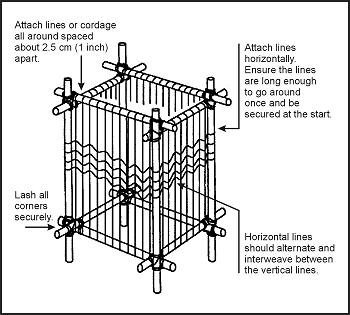

The materials for constructing a backpack are almost limitless. You can use wood, bamboo, rope, plant fiber, clothing, animal skins, canvas, and many other materials to make a pack.

There are several construction techniques for backpacks. Many are very elaborate, but those that are simple and easy are often the most readily made in a survival situation.

**Horseshoe Pack**

This pack is simple to make and use and relatively comfortable to carry over one shoulder. Lay available square-shaped material, such as poncho, blanket, or canvas, flat on the ground. Lay items on one edge of the material. Pad the hard items. Roll the material (with the items) toward the opposite edge and tie both ends securely. Add extra ties along the length of the bundle. You can drape the pack over one shoulder with a line connecting the two ends ([Figure 12-9](#fig12-9)).

**Figure 12-9\. Horseshoe Pack**

**Square Pack**

This pack is easy to construct if rope or cordage is available. Otherwise, you must first make cordage. To make this pack, construct a square frame from bamboo, limbs, or sticks. Size will vary for each person and the amount of equipment carried ([Figure 12-10](#fig12-10)).

**Figure 12-10\. Square Pack**
