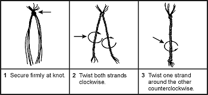

12-25\. Many materials are strong enough for use as cordage and lashing. A number of natural and man-made materials are available in a survival situation. For example, you can make a cotton web belt much more useful by unraveling it. You can then use the string for other purposes (fishing line, thread for sewing, and lashing).

**Natural Cordage Selection**

12-26\. Before making cordage, there are a few simple tests you can do to determine you material's suitability. First, pull on a length of the material to test for strength. Next, twist it between your fingers and roll the fibers together. If it withstands this handling and does not snap apart, tie an overhand knot with the fibers and gently tighten. If the knot does not break, the material is usable. [Figure 12-8](#fig12-8) shows various methods of making cordage.

**Figure 12-8\. Making Lines From Plant Fibers**

**Lashing Material**

The best natural material for lashing small objects is sinew. You can make sinew from the tendons of large game, such as deer. Remove the tendons from the game and dry them completely. Smash the dried tendons so that they separate into fibers. Moisten the fibers and twist them into a continuous strand. If you need stronger lashing material, you can braid the strands. When you use sinew for small lashings, you do not need knots as the moistened sinew is sticky and it hardens when dry.

You can shred and braid plant fibers from the inner bark of some trees to make cord. You can use the linden, elm, hickory, white oak, mulberry, chestnut, and red and white cedar trees. After you make the cord, test it to be sure it is strong enough for your purpose. You can make these materials stronger by braiding several strands together.

You can use rawhide for larger lashing jobs. Make rawhide from the skins of medium or large game. After skinning the animal, remove any excess fat and any pieces of meat from the skin. Dry the skin completely. You do not need to stretch it as long as there are no folds to trap moisture. You do not have to remove the hair from the skin. Cut the skin while it is dry. Make cuts about 6 millimeters (1/4 inch) wide. Start from the center of the hide and make one continuous circular cut, working clockwise to the hide's outer edge. Soak the rawhide for 2 to 4 hours or until it is soft. Use it wet, stretching it as much as possible while applying it. It will be strong and durable when it dries.
