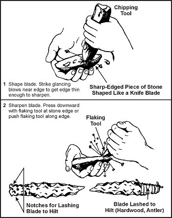
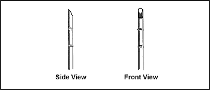

Knives, spear blades, and arrow points fall under the category of edged weapons. The following paragraphs explain how to make such weapons.

**Knives**

A knife has three basic functions. It can puncture, slash or chop, and cut. A knife is also an invaluable tool used to construct other survival items. You may find yourself without a knife or you may need another type knife or a spear. To improvise you can use stone, bone, wood, or metal to make a knife or spear blade.

**Stone**

To make a stone knife, you will need a sharp-edged piece of stone, a chipping tool, and a flaking tool. A chipping tool is a light, blunt-edged tool used to break off small pieces of stone. A flaking tool is a pointed tool used to break off thin, flattened pieces of stone. You can make a chipping tool from wood, bone, or metal, and a flaking tool from bone, antler tines, or soft iron ([Figure 12-3](#fig12-3)).

**Figure 12-3\. Making a Stone Knife**

Start making the knife by roughing out the desired shape on your sharp piece of stone, using the chipping tool. Try to make the knife fairly thin. Then, press the flaking tool against the edges. This action will cause flakes to come off the opposite side of the edge, leaving a razor-sharp edge. Use the flaking tool along the entire length of the edge you need to sharpen. Eventually, you will have a very, sharp cutting edge that you can use as a knife.

Lash the blade to some type of hilt ([Figure 12-3](#fig12-3)).

**NOTE:** Stone will make an excellent puncturing tool and a good chopping tool but will not hold a fine edge. Some stones such as chert or flint can have very fine edges.

**Bone**

You can also use bone as an effective field-expedient edged weapon. First, you will need to select a suitable bone. The larger bones, such as the leg bone of a deer or another medium-sized animal, are best. Lay the bone upon another hard object. Shatter the bone by hitting it with a heavy object, such as a rock. From the pieces, select a suitable pointed splinter. You can further shape and sharpen this splinter by rubbing it on a rough-surfaced rock. If the piece is too small to handle, you can still use it by adding a handle to it. Select a suitable piece of hardwood for a handle and lash the bone splinter securely to it.

**NOTE:** Use the bone knife only to puncture. It will not hold an edge and it may flake or break if used differently.

**Wood**

You can make field-expedient edged weapons from wood. Use these only to puncture. Bamboo is the only wood that will hold a suitable edge. To make a knife from wood, first select a straight-grained piece of hardwood that is about 30 centimeters (12 inches) long and 2.5 centimeters (1 inch) in diameter. Fashion the blade about 15 centimeters (6 inches) long. Shave it down to a point. Use only the straight-grained portions of the wood. Do not use the core or pith, as it would make a weak point.

Harden the point by a process known as fire hardening. If a fire is possible, dry the blade portion over the fire slowly until lightly charred. The drier the wood, the harder the point. After lightly charring the blade portion, sharpen it on a coarse stone. If using bamboo and after fashioning the blade, remove any other wood to make the blade thinner from the inside portion of the bamboo. Removal is done this way because bamboo's hardest part is its outer layer. Keep as much of this layer as possible to ensure the hardest blade possible. When charring bamboo over a fire, char only the inside wood; do not char the outside.

**Metal**

Metal is the best material to make field-expedient edged weapons. Metal, when properly designed, can fulfill a knife's three uses: puncture, slice or chop, and cut. First, select a suitable piece of metal, one that most resembles the desired end product. Depending on the size and original shape, you can obtain a point and cutting edge by rubbing the metal on a rough-surfaced stone. If the metal is soft enough, you can hammer out one edge while the metal is cold. Use a suitable flat, hard surface as an anvil and a smaller, harder object of stone or metal as a hammer to hammer out the edge. Make a knife handle from wood, bone, or other material that will protect your hand.

**Other Materials**

You can use other materials to produce edged weapons. Glass is a good alternative to an edged weapon or tool, if no other material is available. Obtain a suitable piece in the same manner as described for bone. Glass has a natural edge but is less durable for heavy work. You can also sharpen plastic - if it is thick enough or hard enough - into a durable point for puncturing.

**Spear Blades**

To make spears, use the same procedures to make the blade that you used to make a knife blade. Then select a shaft (a straight sapling) 1.2 to 1.5 meters (4 to 5 feet) long. The length should allow you to handle the spear easily and effectively. Attach the spear blade to the shaft using lashing. The preferred method is to split the handle, insert the blade, then wrap or lash it tightly. You can use other materials without adding a blade. Select a 1.2- to 1.5-meter (4- to 5-foot) long straight hardwood shaft and shave one end to a point. If possible, fire-harden the point. Bamboo also makes an excellent spear. Select a piece 1.2 to 1.5 meters (4 to 5 feet) long. Starting 8 to 10 centimeters (3 to 4 inches) back from the end used as the point, shave down the end at a 45-degree angle ([Figure 12-4](#fig12-4)). Remember, to sharpen the edges, shave only the inner portion.

**Figure 12-4\. Bamboo Spear**

**Arrow Points**

To make an arrow point, use the same procedures for making a stone knife blade. Chert, flint, and shell-type stones are best for arrow points. You can fashion bone like stone - by flaking. You can make an efficient arrow point using broken glass.
