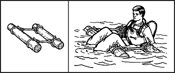

17-21\. If the water is warm enough for swimming and you do not have the time or materials to construct one of the poncho-type rafts, you can use various flotation devices to negotiate the water obstacle. Some items you can use for flotation devices are-
*  _Trousers._ Knot each trouser leg at the bottom and close the fly. With both hands, grasp the waistband at the sides and swing the trousers in the air to trap air in each leg. Quickly press the sides of the waistband together and hold it underwater so that the air will not escape. You now have water wings to keep you afloat as you cross the body of water.

**NOTE:** Wet the trousers before inflating to trap the air better You may have to reinflate the trousers several times when crossing a large body of water.
*  _Empty containers._ Lash together empty gas cans, water jugs, ammo cans, boxes, or other items that will trap or hold air. Use them as water wings. Use this type of flotation device only in a slow-moving river or stream.
*  _Plastic bags and ponchos._ Fill two or more plastic bags with air and secure them together at the opening. Use your poncho and roll green vegetation tightly inside it so that you have a roll at least 20 centimeters (8 inches) in diameter. Tie the ends of the roll securely. You can wear it around your waist or across one shoulder and under the opposite arm.
*  _Logs._ Use a stranded drift log if one is available, or find a log near the water to use as a float. Be sure to test the log before starting to cross. Some tree logs-palm, for example-will sink even when the wood is dead. Another method is to tie two logs about 60 centimeters (24 inches) apart. Sit between the logs with your back against one and your legs over the other ([Figure 17-8](#fig17-8)).
*  _Cattails._ Gather stalks of cattails and tie them in a bundle 25 centimeters (10 inches) or more in diameter. The many air cells in each stalk cause a stalk to float until it rots. Test the cattail bundle to be sure it will support your weight before trying to cross a body of water.

**Figure 17-8\. Log Flotation**

17-22\. There are many other flotation devices that you can devise by using some imagination. Just make sure to test the device before trying to use it.
