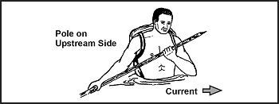
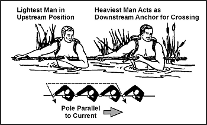
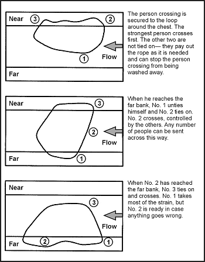

17-6\. If necessary, you can safely cross a deep, swift river or rapids. To swim across a deep, swift river, swim with the current, never fight it. Try to keep your body horizontal to the water. This will reduce the danger of being pulled under.

17-7\. In fast, shallow rapids, lie on your back, feet pointing downstream, finning your hands alongside your hips. This action will increase buoyancy and help you steer away from obstacles. Keep your feet up to avoid getting them bruised or caught by rocks.

17-8\. In deep rapids, lie on your stomach, head downstream, angling toward the shore whenever you can. Watch for obstacles and be careful of backwater eddies and converging currents, as they often contain dangerous swirls. Converging currents occur where new watercourses enter the river or where water has been diverted around large obstacles such as small islands.

17-9\. To ford a swift, treacherous stream, apply the following steps:
*  Remove your pants and shirt to lessen the water's pull on you. Keep your footgear on to protect your feet and ankles from rocks. It will also provide you with firmer footing.
*  Tie your pants and other articles to the top of your rucksack or in a bundle, if you have no pack. This way, if you have to release your equipment, all your articles will be together. It is easier to find one large pack than to find several small items.
*  Carry your pack well up on your shoulders and be sure you can easily remove it, if necessary. Not being able to get a pack off quickly enough can drag even the strongest swimmers under.
*  Find a strong pole about 5 to 10 centimeters (3 inches) in diameter and 2 to 2.5 meters (7 to 8 feet) long to help you ford the stream. Grasp the pole and plant it firmly on your upstream side to break the current. Plant your feet firmly with each step, and move the pole forward a little downstream from its previous position, but still upstream from you. With your next step, place your foot below the pole. Keep the pole well slanted so that the force of the current keeps the pole against your shoulder ([Figure 17-1](#fig17-1)).
*  Cross the stream so that you will cross the downstream current at a 45-degree angle.

**Figure 17-1\. One Man Crossing Swift Stream**

17-10\. Using this method, you can safely cross currents usually too strong for one person to stand against. Do not concern yourself about your pack's weight, as the weight will help rather than hinder you in fording the stream.

17-11\. If there are other people with you, cross the stream together. Ensure that everyone has prepared their pack and clothing as outlined above. Position the heaviest person on the downstream end of the pole and the lightest on the upstream end. In using this method, the upstream person breaks the current, and those below can move with relative ease in the eddy formed by the upstream person. If the upstream person gets temporarily swept off his feet, the others can hold steady while he regains his footing ([Figure 17-2](#fig17-2)).

**Figure 17-2\. Several Men Crossing Swift Stream**

17-12\. If you have three or more people and a rope available, you can use the technique shown in [Figure 17-3](#fig17-3) to cross the stream. The length of the rope must be three times the width of the stream.

**Figure 17-3\. Individuals Tied Together to Cross Stream**
