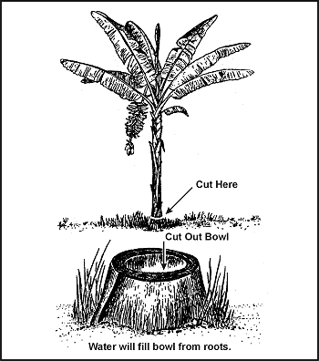

Almost any environment has water present to some degree. Possible sources of water in various environments are listed below. Information on how to make the water potable is provided as well.

**NOTE:** If you do not have a canteen, cup, can, or other type of container, improvise one from plastic or water-resistant cloth. Shape the plastic or cloth into a bowl by pleating it. Use pins or other suitable items-even your hands-to hold the pleats.

* **Frigid areas**
* **Snow and ice**
* **Means of obtaining and/or making potable:** Melt and purify.
* **Remarks:** Do not eat without melting! Eating snow or ice can reduce body temperature and lead to more dehydration.
Snow or ice are no purer than the water from which they come.
Sea ice that is gray in color or opaque is salty. Do not use it without desalting it. Sea ice that is crystalline with a bluish cast has littler salt in it.
* **At sea**
* **Sea**
* **Means of obtaining and/or making potable:** Use desalinator.
* **Remarks:** Do not drink seawater without desalting!
* **Rain**
* **Means of obtaining and/or making potable:** Catch rain in tarps or in other water-holding containers.
* **Remarks:** If tarp or water-holding material is coated with salt, wash it in the sea before using (very littler salt will remain on it).
* **Sea ice**
* **Remarks:** See previous remarks for frigid areas.
* **Beach**
* **Ground**
* **Means of obtaining and/or making potable:** Dig hole deep enough to allow water to seep in; obtain rocks, build fire, and heat rocks; drop hot rocks in water; hold cloth over hole to absorb steam; wring water from cloth.
* **Remarks:** Alternate method if a container or bark pot is available: Fill container or pot with seawater; build fire and boil water to produce steam; hold cloth over container to absorb steam; wring water from cloth.
* **Fresh**
* **Means of obtaining and/or making potable:** Dig behind first group of sand dunes. This will allow the collection of fresh water.
* **Desert**
* **Sources of water:**
* In valleys and low areas
* At foot of concave banks of dry rivers
* At foot of cliffs or rock outcrops
* At first depression behind first sand dune of dry lakes
* Wherever you find damp sand surface sand
* Wherever you find green vegetation
* **Means of obtaining and/or making potable:** Dig holes deep enough to allow water to seep in.
* **Remarks:** In a sand dune belt, any available water will be found beneath the original valley floow at the edge of dunes.
* **Desert (extended)**
* **Cacti**
* **Means of obtaining and/or making potable:** Cut off the top of a barrel cactus and mash or squeeze the pulp.
**CAUTION: Do not eat pulp. Place pulp in mouth, suck out juice, and discard pulp.**
* **Remarks:** Without a machete, cutting into a cactus is difficult and takes time since you must get past the long, strong spines and cut through the tough rind.
* **Depressions or holes in rocks**
* **Remarks:** Periodic rainfall may collect in pools, seep into fissures, or collect in holes in rocks.
* **Fissures in rock**
* **Means of obtaining and/or making potable:** Insert flexible tubing and siphon water. If fissure is large enough, you can lower a container into it.
* **Porous rock**
* **Means of obtaining and/or making potable:** Insert flexible tubing and siphon water.
* **Condensation on metal**
* **Means of obtaining and/or making potable:** Use cloth to absorb water, then wring water from cloth.
* **Remarks:** Extreme temperature variations between night and day may cause condensation on metal surfaces. Following are signs to watch for in the desert to help you find water:
* All trails lead to water. You should follow in the direction in which the trails converge. Signs of camps, campfire ashes, animal droppings, and trampled terrain may mark trails.
* Flocks of birds will circle over water holes. Some birds fly to water holes at dawn and sunset. Their flight at these times is usually fast and close to the ground. Bird tracks or chirping sounds in the evening or early morning sometimes indicate that water is nearby.

If you do not have a reliable source to replenish your water supply, stay alert for ways in which your environment can help you.

> **CAUTION**
>
> DO NOT substitute the following harmful fluids for water.

Fluid | Remarks
----- | ------
Alcoholic beverages | Dehydrate the body and cloud judgement.
Urine | Contains harmful body wastes. Is about 2 percent salt.
Blood | Is salty and considered a food; therefore, requires additional body fluids to digest. May transmit disease.
Seawater | Is about 4 percent salt. It takes about 2 liters of body fluids to rid the body of waster from 1 liter of seawater. Therefore, by drinking seawater you deplete your body's water supply, which can cause death.

Heavy dew can provide water. Tie rags or tufts of fine grass around your ankles and walk through dew-covered grass before sunrise. As the rags or grass tufts absorb the dew, wring the water into a container. Repeat the process until you have a supply of water or until the dew is gone. Australian natives sometimes mop up as much as 1 liter an hour this way.

Bees or ants going into a hole in a tree may point to a water-filled hole. Siphon the water with plastic tubing or scoop it up with an improvised dipper. You can also stuff cloth in the hole to absorb the water and then wring it from the cloth.

Water sometimes gathers in tree crotches or rock crevices. Use the above procedures to get the water. In arid areas, bird droppings around a crack in the rocks may indicate water in or near the crack.

Green bamboo thickets are an excellent source of fresh water. Water from green bamboo is clear and odorless. To get the water, bend a green bamboo stalk, tie it down, and cut off the top ([Figure 6-3](#fig6-3)). The water will drip freely during the night. Old, cracked bamboo may also contain water.

**Figure 6-3\. Water From Green Bamboo**

> **CAUTION**
>
> Purify the water before drinking it.

Wherever you find banana trees, plantain trees, or sugarcane, you can get water. Cut down the tree, leaving about a 30-centimeter (12-inch) stump, and scoop out the center of the stump so that the hollow is bowl-shaped. Water from the roots will immediately start to fill the hollow. The first three fillings of water will be bitter, but succeeding fillings will be palatable. The stump ([Figure 6-4](#fig6-4)) will supply water for up to 4 days. Be sure to cover it to keep out insects.

**Figure 6-4\. Water From Plantain or Banana Tree Stump**

Some tropical vines can give you water. Cut a notch in the vine as high as you can reach, then cut the vine off close to the ground. Catch the dropping liquid in a container or in your mouth ([Figure 6-5](#fig6-5)).

> **CAUTION**
>
> Ensure that the vine is not poisonous.

**Figure 6-5\. Water From a Vine**

The milk from young, green (unripe) coconuts is a good thirst quencher. However, the milk from mature, brown, coconuts contains an oil that acts as a laxative. Drink in moderation only.

> **CAUTION**
>
> Do not drink the liquid if it is sticky, milky, or bitter tasting.

In the American tropics you may find large trees whose branches support air plants. These air plants may hold a considerable amount of rainwater in their overlapping, thickly growing leaves. Strain the water through a cloth to remove insects and debris.

You can get water from plants with moist pulpy centers. Cut off a section of the plant and squeeze or smash the pulp so that the moisture runs out. Catch the liquid in a container.

Plant roots may provide water. Dig or pry the roots out of the ground, cut them into short pieces, and smash the pulp so that the moisture runs out. Catch the liquid in a container.

Fleshy leaves, stems, or stalks, such as bamboo, contain water. Cut or notch the stalks at the base of a joint to drain out the liquid.

The following trees can also provide water:

* _Palms._ The buri, coconut, sugar, rattan, and nips contain liquid. Bruise a lower frond and pull it down so the tree will "bleed" at the injury.
* _Traveler's tree._ Found in Madagascar, this tree has a cuplike sheath at the base of its leaves in which water collects.
* _Umbrella tree._ The leaf bases and roots of this tree of western tropical Africa can provide water.
* _Baobab tree._ This tree of the sandy plains of northern Australia and Africa collects water in its bottlelike trunk during the wet season. Frequently, you can find clear, fresh water in these trees after weeks of dry weather.

> **CAUTION**
>
> Do not keep the sap from plants longer than 24 hours. It begins fermenting, becoming dangerous as a water source.
